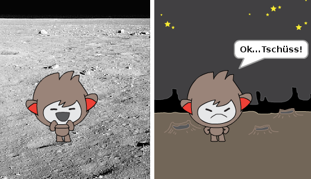
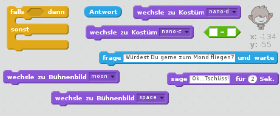
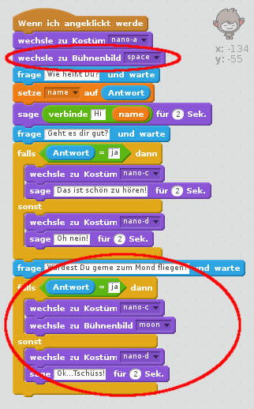
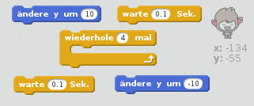
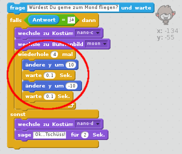

## Ortswechsel

Du kannst deinen Chatbot auch programmieren, seinen Standort zu wechseln.

\--- task \---

Füge deiner Bühne ein neues Bühnenbild hinzu, z. B. das Mond- ("moon"-) Bild.

\--- /task \---

\--- task \---

Kannst Du deinen Chatbot programmieren zu fragen: "Würdest du gerne zum Mond fliegen?" und dann den Standort ändern, wenn die Antwort "Ja" ist?

Testen und speichern. Wenn Du "Ja" antwortest, sollte dein Chatbot den Standort wechseln. Er sollte ein trauriges Gesicht machen und "OK... Tschüss!" sagen, wenn irgendeine andere Antwort gegeben wird.

\--- hints \--- \--- hint \--- Dein Chatbot sollte **fragen** "Würdest Du gerne zum Mond fliegen?". **Falls** deine **Antwort** "ja" lautet, sollte dein Chatbot sein **Kostüm ändern** und ein fröhliches Gesicht machen und das **Bühnenbild** sollte wechseln.

Wenn Du mit "nein" antwortest, sollte der Chatbot das **Kostüm wechseln **, traurig aussehen und ** sagen: ** "OK... Tschüss!"

Du musst auch Code hinzufügen, damit dein Chatbot am richtigen Ort gestartet wird, **wenn die grüne Fahne angeklickt** wird. \--- /hint \--- \--- hint \--- Hier sind die Code-Blöcke, die Du brauchen wirst:  \--- /hint \--- \--- hint \--- So sollte dein Code aussehen:  \--- /hint \--- \--- /hints \---

\--- /task \---

\--- task \---

Kannst Du Code hinzufügen, der deinen Chatbot vor Freude in die Luft springen lässt, wenn Du ihm sagst, dass Du zum Mond fliegen möchtest?

Testen und speichern. Wenn Du "Ja" antwortest, sollte dein Chatbot auf und ab hüpfen. Er sollte nicht hüpfen, wenn irgendeine andere Antwort gegeben wird.

\--- hints \--- \--- hint \---Dein Chatbot sollte hoch hüpfen, indem Du **y um** einen kleinen Betrag **änderst** und nach einer kurzen **Warte**zeit zur Ausgangsposition zurückkehren. Vielleicht möchtest Du das einige Male **wiederholen**. \--- /hint \--- \--- hint \--- Hier sind die Code-Blöcke, die Du brauchen wirst:  \--- /hint \--- \--- hint \--- So sollte dein Code aussehen:  \--- /hint \--- \--- /hints \---

\--- /task \---