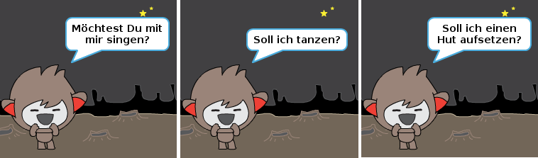

--- challenge ---

## Herausforderung: Vervollständige deinen Chatbot

Nutze das Erlernte, um deinen interaktiven Chatbot fertig zu gestalten. Hier sind einige Anregungen:

Sobald du deinen Chatbot fertiggestellt hast, lasse deine Freunde mit ihm sprechen! Mögen sie deine Kreatur? Haben sie irgendwelche Probleme entdeckt? 

--- /challenge ---

***

Dieses Projekt wurde von freiwilligen Helfern übersetzt:

Thorsten Billib

Anastasia Heilmann

Helmut Schlimper

Dank freiwilliger Helfer können wir Menschen auf der ganzen Welt die Möglichkeit geben, in ihrer eigenen Sprache zu lernen. Du kannst uns helfen, mehr Menschen zu erreichen, indem Du dich freiwillig zum Übersetzen meldest - weitere Informationen unter [rpf.io/translate](https://rpf.io/translate).
