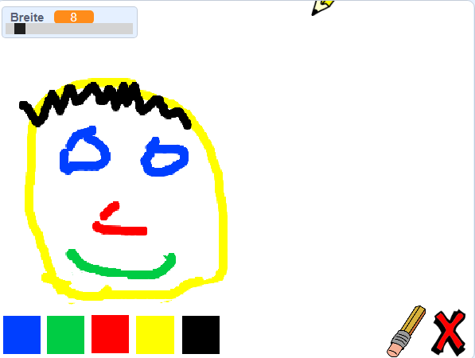

## Was kommt als nächstes?

Schau dir das [Paint box](https://projects.raspberrypi.org/en/projects/paint-box?utm_source=pathway&utm_medium=whatnext&utm_campaign=projects)-Projekt an, wo du dein eigenes Malprogramm erstellen kannst!

--- no-print ---

Klicke zum Starten auf die grüne Flagge. Verwende die Maus, um den Stift zu bewegen und halte die linke Maustaste gedrückt, um zu zeichnen. Klicke auf eine Farbe, um die Malfarbe des Stiftes zu wechseln. Klicke auf den Radierer, um ihn zu nehmen und Teile deiner Zeichnung zu löschen, wenn du die linke Maustaste dabei drückst. Um die ganze Seite zu löschen, klicke auf das rote Kreuz.

  <iframe allowtransparency="true" width="485" height="402" src="//scratch.mit.edu/projects/embed/267243161/?autostart=false" frameborder="0" scrolling="no"></iframe>
  

--- /no-print ---

--- print-only ---

Klicke auf die grüne Flagge um zu starten, und verwende die Computermaus, um den Stift zu bewegen, und halte die linke Maustaste gedrückt, um zu zeichnen. Wenn du auf eine der Farben unten klickst, ändert sich die Farbe des Stiftes, und wenn du du auf den Radierer klickst, kannst du ihn verwenden, um zu löschen!

--- /print-only ---
