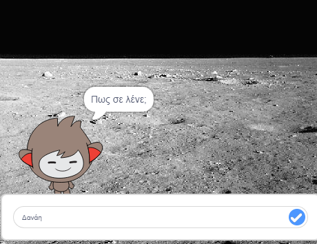

\--- no-print \---

Αυτή είναι η έκδοση **Scratch 3** του έργου. Υπάρχει επίσης και μία έκδοση [Scratch 2](https://projects.raspberrypi.org/en/projects/chatbot-scratch2) του έργου.

\--- /no-print \---

## Εισαγωγή

Πρόκειται να μάθεις πως να προγραμματίζεις έναν χαρακτήρα που θα μπορεί να σου μιλάει! Ένας τέτοιος χαρακτήρας ονομάζεται "ρομπότ συζήτησης" ή chatbot (στα αγγλικά).

### Τι θα κάνεις

\--- no-print \---

Κάνε κλικ στην πράσινη σημαία και στη συνέχεια κλικ στο chatbot για να αρχίσει μία συζήτηση. Όταν το chatbot σε ρωτήσει, πληκτρολόγησε την απάντησή σου στο πλαίσιο στο κάτω μέρος του Σκηνικού και κάνε κλικ στο μπλε σημάδι στα δεξιά (ή πάτησε `Enter`) για να δεις την απάντηση του chatbot.

  <iframe allowtransparency="true" width="485" height="402" src="https://scratch.mit.edu/projects/embed/248864190/?autostart=false" 
  frameborder="0" scrolling="no"></iframe>

\--- /no-print \---

\--- print-only \---

\--- /print-only \---

## \--- collapse \---

## title: What you will need

### Υλικό

- Υπολογιστής ικανός να τρέχει το Scratch 3

### Λογισμικό

- Scratch 3 (είτε [online](https://rpf.io/scratchon) είτε [offline](https://rpf.io/scratchoff))

### Λήψεις

- [Βρες αρχεία για να κατεβάσεις εδώ](http://rpf.io/p/en/chatbot-go).

\--- /collapse \---

## \--- collapse \---

## title: What you will learn

- Use code to join text in Scratch
- Θα μάθεις ότι οι μεταβλητές μπορούν να χρησιμοποιηθούν για να αποθηκεύουν το κείμενο που εισάγεται από έναν χρήστη.
- Use conditional selection to respond to user input in Scratch

\--- /collapse \---

## \--- collapse \---

## title: Additional notes for educators

\--- no-print \---

If you need to print this project, please use the [printer-friendly version](https://projects.raspberrypi.org/en/projects/chatbot/print){:target="_blank"}.

\--- /no-print \---

You can find the [completed project here](http://rpf.io/p/en/chatbot-get).

\--- /collapse \---