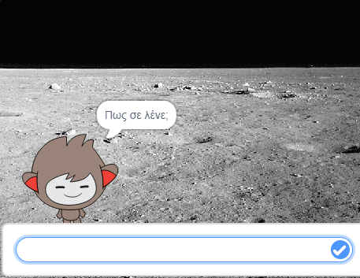
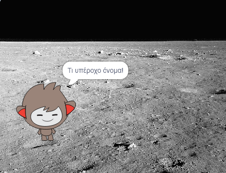
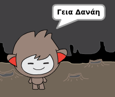

## Ένα ομιλόν chatbot

Τώρα που έχεις ένα chatbot με προσωπικότητα, θα το προγραμματίσεις για να σου μιλά.

\--- task \---

Κάνε κλικ στο chatbot, και πάτα αυτόν τον κώδικα έτσι ώστε `όταν πατιέται`{:class="block3events"}, να `ρωτάει το όνομα σου`{:class="block3sensing"} και μετά να `λέει "Τι υπέροχο όνομα!"`{:class="block3looks"}.


```blocks3
when this sprite clicked
ask [What's your name?] and wait
say [What a lovely name!] for (2) seconds
```

\--- /task \---

\--- task \---

Κάνε κλικ στο chatbot για να δοκιμάσεις τον κωδικα. Όταν το chatbot ρωτήσει το όνομα σου, γράψε το στο κουτί που εμφανίζεται στο κάτω μέρος του σκηνικού, και μετά κάνε κλικ στο μπλε σημάδι, ή πάτα <kbd>Enter</kbd>.





\--- /task \---

\--- task \---

Αυτή τη στιγμή, το chatbot απαντάει "Τι υπέροχο όνομα!" κάθε φορά που απαντάς. Μπορείς να κάνεις το chatbot να απαντάει πιο προσωπικά, έτσι ώστε η απάντηση να είναι διαφορετική κάθε φορά που πληκτρολογείς διαφορετικό όνομα.

Άλλαξε τον κώδικα του chatbot σε `join`{:class="block3operators"} "Γεια σου" μαζί με την `απάντηση`{:class="block3sensing"} στην ερώτηση "Πώς σε λένε;", έτσι ώστε ο κώδικας να μοιάζει έτσι:


```blocks3
when this sprite clicked
ask [What's your name?] and wait
say (join [Hi ] (answer) :: +) for (2) seconds
```



\--- /task \---

\--- task --

Αποθηκεύοντας την απάντηση σε μία **μεταβλητή**, μπορείς να τη χρησιμοποιήσεις οπουδήποτε στο έργο σου.

Δημιούργησε μία νέα μεταβλητή που θα την ονομάσεις `όνομα`{:class="block3variables"}.

[[[generic-scratch3-add-variable]]]

\--- /task \---

\--- task --

Τώρα άλλαξε τον κώδικα του chatbot για να θέσεις τη μεταβλητή `όνομα`{:class="block3variables"} ίση με την `απάντηση`{:class="block3sensing"}:


```blocks3
when this sprite clicked
ask [What's your name?] and wait

+ set [name v] to (answer)
say (join [Hi ] (name :: variables +)) for (2) seconds
```

Ο κώδικάς σου θα πρέπει να λειτουργεί όπως πριν: το chatbot σου θα πρέπει να πει "Γεια" χρησιμοποιώντας το όνομά που πληκτρολόγησες.


\--- /task \---

Δοκίμασε ξανά το πρόγραμμά σου. Παρατήρησε ότι η απάντηση που πληκτρολογείς αποθηκεύεται στη μεταβλητή `όνομα`{:class="block3variables"} κι επίσης εμφανίζεται στην πάνω αριστερά γωνία του σκηνικού. Για να την κάνεις να εξαφανιστεί από το σκηνικό, πήγαινε στην ομάδα των μπλοκ `Δεδομένα`{:class="block3variables"} και κάνε κλικ στο κουτί δίπλα στο `όνομα`{:class="block3variables"} ώστε να μην είναι επιλεγμένο.