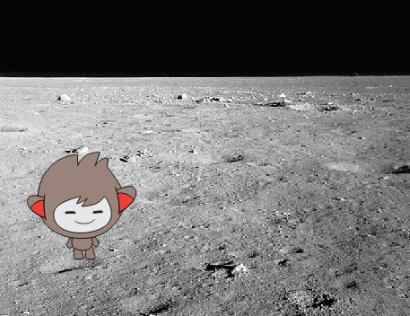

## Το chatbot σου

--- task ---

Πριν αρχίσεις να δημιουργείς το chatbot σου, πρέπει να αποφασίσεις για την προσωπικότητά του. **Σκέψου τις ακόλουθες ερωτήσεις**:

    + Ποιο είναι το όνομά του;
    + Πού ζει;
    + Είναι ευχαριστημένο; Σοβαρό; Αστείο; Ντροπαλό; Φιλικό;
    

--- /task ---

--- task ---

Άνοιξε ένα νέο έργο στο Scratch.

[[[generic-scratch-new-project]]]

--- /task ---

--- task ---

Επέλεξε ένα από αυτά τα αντικείμενα χαρακτήρων και πρόσθεσέ το στο έργο σου:

[[[generic-scratch-sprite-from-library]]]

--- /task ---

--- task ---

Διάλεξε ένα υπόβαθρο που ταιριάζει με την προσωπικότητα του chatbot. Ακολουθεί ένα παράδειγμα, αν και το δικό σου δεν χρειάζεται να μοιάζει με αυτό:

[[[generic-scratch-backdrop-from-library]]]

--- /task ---

--- task ---

Αποθήκευσε το έργο σου.

[[[generic-scratch-saving]]]

--- /task ---
