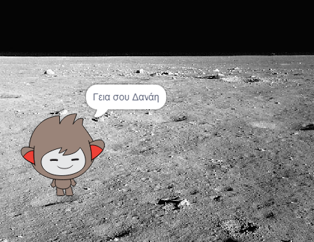

## Ένα ομιλόν chatbot

Τώρα που έχεις ένα chatbot με προσωπικότητα, θα το προγραμματίσεις για να σου μιλά.

\--- task \---

Κάνε κλικ στο chatbot, και πάτα αυτόν τον κώδικα έτσι ώστε `όταν πατιέται`{:class="block3events"}, να `ρωτάει το όνομά σου`{:class="block3sensing"} και μετά να `λέει "Τι υπέροχο όνομα!"`{:class="block3looks"}.


```blocks3
όταν γίνει κλικ σε αυτό το αντικείμενο
ρώτησε [Πώς σε λένε;] και περίμενε
πες [Τι υπέροχο όνομα!] για (2) δευτερόλεπτα
```

\--- /task \---

\--- task \---

Κάνε κλικ στο chatbot για να δοκιμάσεις τον κώδικα. Όταν το chatbot ρωτήσει το όνομά σου, γράψε το στο κουτί που εμφανίζεται στο κάτω μέρος του σκηνικού, και μετά κάνε κλικ στο μπλε σημάδι, ή πάτα <kbd>Enter</kbd>.


\--- /task \---

\--- task \---

Αυτή τη στιγμή, το chatbot απαντάει "Τι υπέροχο όνομα!" κάθε φορά που απαντάς. Μπορείς να κάνεις το chatbot να απαντάει πιο προσωπικά, έτσι ώστε η απάντηση να είναι διαφορετική κάθε φορά που πληκτρολογείς διαφορετικό όνομα.

Άλλαξε τον κώδικα του chatbot σε `join`{:class="block3operators"} "Γεια σου" μαζί με την `απάντηση`{:class="block3sensing"} στην ερώτηση "Πώς σε λένε;", έτσι ώστε ο κώδικας να μοιάζει έτσι:


```blocks3
όταν γίνει κλικ σε αυτό το αντικείμενο
ρώτησε [Πώς σε λένε;] και περίμενε
πες (ένωσε [Γεια σου ] (απάντηση) :: +) για (2) δευτερόλεπτα
```



\--- /task \---

\--- task --

Αποθηκεύοντας την απάντηση σε μία **μεταβλητή**, μπορείς να τη χρησιμοποιήσεις οπουδήποτε στο έργο σου.

Δημιούργησε μία νέα μεταβλητή που θα την ονομάσεις `όνομα`{:class="block3variables"}.

[[[generic-scratch3-add-variable]]]

\--- /task \---

\--- task --

Τώρα άλλαξε τον κώδικα του chatbot για να θέσεις τη μεταβλητή `όνομα`{:class="block3variables"} ίση με την `απάντηση`{:class="block3sensing"}:


```blocks3
όταν γίνει κλικ σε αυτό το αντικείμενο
ρώτησε [Πώς σε λένε;] και περίμενε
+ όρισε [όνομα v] σε (απάντηση)
πες (ένωσε [Γεια σου ] (όνομα :: + variables)) για (2) δευτερόλεπτα
```

Ο κώδικάς σου θα πρέπει να λειτουργεί όπως πριν: το chatbot σου θα πρέπει να πει "Γεια" χρησιμοποιώντας το όνομα που πληκτρολόγησες.


\--- /task \---

Δοκίμασε ξανά το πρόγραμμά σου. Παρατήρησε ότι η απάντηση που πληκτρολογείς αποθηκεύεται στη μεταβλητή `όνομα`{:class="block3variables"} κι επίσης εμφανίζεται στην πάνω αριστερά γωνία του σκηνικού. To make it disappear from the Stage, go to the `Variables`{:class="block3variables"} blocks section and click on the box next to `name`{:class="block3variables"} so that it is not marked.