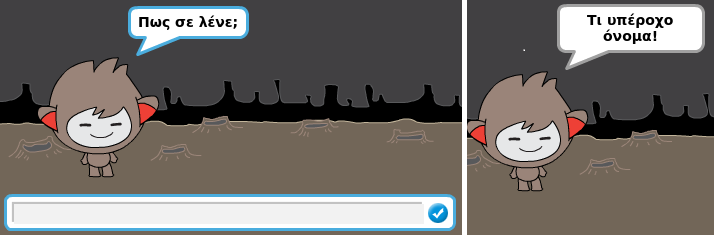
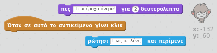
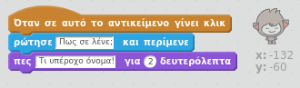
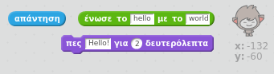
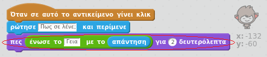
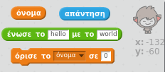
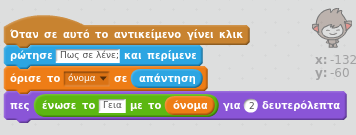
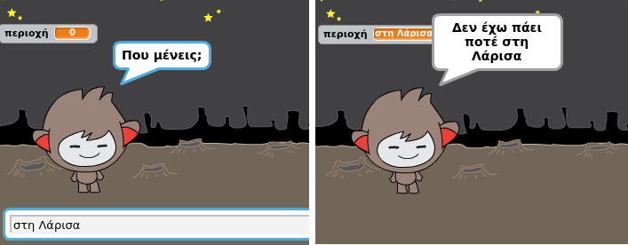

## Ένα ομιλόν chatbot

Τώρα που έχεις ένα chatbot με προσωπικότητα, ας το προγραμματίσεις για να σου μιλά.

--- task ---

Πρόσθεσε κώδικα στο chatbot έτσι ώστε όταν κάνεις κλικ, να ρωτά το όνομά σου και στη συνέχεια να λέει "Τι υπέροχο όνομα!"

--- hints --- --- hint --- Όταν το chatbot **αντικείμενο πατηθεί**, πρέπει **να ρωτήσει** για το όνομά σου. Το chatbot θα πρέπει τότε **να πει** "Τι υπέροχο όνομα!" --- /hint --- --- hint --- Εδώ είναι τα μπλοκ κώδικα που θα χρειαστείς:  --- /hint --- --- hint --- Έτσι πρέπει να είναι ο κώδικάς σου:  --- /hint --- --- /hints ---

--- /task ---

--- task ---

Τώρα το chatbot απλά απαντά κάθε φορά "Τι υπέροχο όνομα!". Μπορείς να προσαρμόσεις την απάντηση του chatbot χρησιμοποιώντας την απάντησή σου;

--- hints --- --- hint --- Όταν το chatbot **αντικείμενο πατηθεί**, πρέπει **να ρωτήσει** για το όνομά σου. Το chatbot θα πρέπει στη συνέχεια **να λέει** "Γεια", ακολουθούμενο από την **απάντησή** σου. --- /hint --- --- hint --- Εδώ είναι τα μπλοκ κώδικα που θα χρειαστείς:  --- /hint --- --- hint --- Έτσι πρέπει να είναι ο κώδικάς σου:  --- /hint --- --- /hints ---

--- /task ---

--- task ---

Εάν αποθηκεύσεις την απάντησή σου σε μια **μεταβλητή**, τότε μπορεί να χρησιμοποιηθεί αργότερα. Δημιούργησε μία νέα μεταβλητή που ονομάζεται `όνομα` για να αποθηκεύσεις το όνομά σου.

[[[generic-scratch-add-variable]]]

--- /task ---

--- task ---

Μπορείς να αποθηκεύσεις την απάντησή σου στη μεταβλητή `όνομα` και να την χρησιμοποιήσεις στην απάντηση του chatbot;

Ο κώδικάς σου θα πρέπει να λειτουργεί όπως πριν: το chatbot σου θα πρέπει να πει "Γεια" χρησιμοποιώντας το όνομά σου.

--- hints --- --- hint --- Όταν το chatbot **αντικείμενο πατηθεί**, πρέπει **να ρωτήσει** για το όνομά σου. Στη συνέχεια, θα πρέπει να **ορίσεις** τη μεταβλητή `όνομα` στην **απάντησή** σου. Το chatbot θα πρέπει στη συνέχεια **να λέει** "Γεια", ακολουθούμενο από το **όνομά** σου. --- /hint --- --- hint --- Εδώ είναι τα μπλοκ κώδικα που θα χρειαστείς:  --- /hint --- --- hint --- Έτσι πρέπει να είναι ο κώδικάς σου:  --- /hint --- --- /hints ---

--- /task ---

--- challenge ---

## Πρόκληση: περισσότερες ερωτήσεις

Προγραμμάτισε το chatbot για να κάνει άλλη μία ερώτηση. Μπορείς να αποθηκεύσεις την απάντηση σε μια νέα μεταβλητή;

 --- /challenge ---
