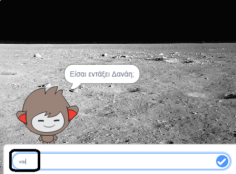
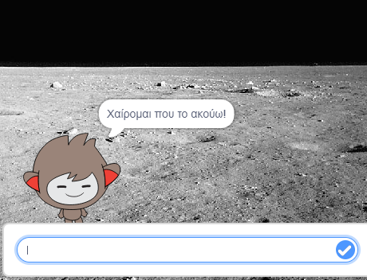
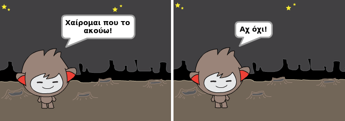
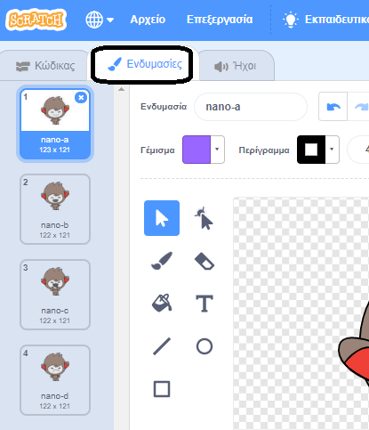
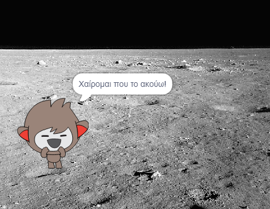
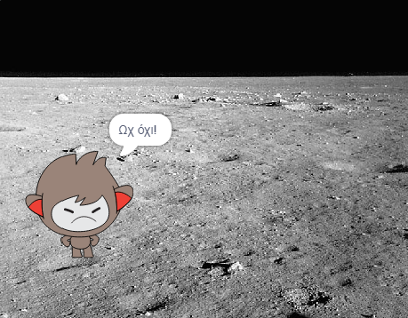
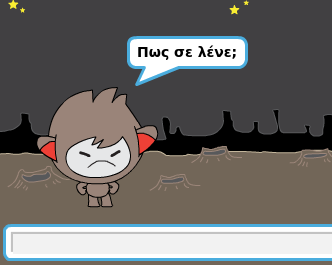
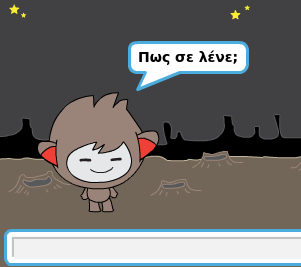

## Λαμβάνοντας αποφάσεις

Μπορείς να προγραμματίσεις το chatbot για να αποφασίσει τι να κάνει με βάση τις απαντήσεις που λαμβάνει.

Αρχικά, θα κάνεις το chatbot να ρωτήσει μία ερώτηση που μπορεί να απαντηθεί με "ναι" ή "όχι".

\--- task \---

Άλλαξε τον κώδικα του chatbot. Το chatbot θα πρέπει να κάνει την ερώτηση "Είσαι καλά όνομα", χρησιμοποιώντας τη μεταβλητή `όνομα`{:class="block3variables"}. Μετά θα πρέπει να απαντήσει "Χαίρομαι που το ακούω!" `αν`{:class="block3control"} (εάν) η απάντηση που λαμβάνει είναι "ναι", αλλά να μην πει τίποτα,αν η απάντηση είναι "όχι".






```blocks3
όταν γίνει κλικ σε αυτό το αντικείμενο
ρώτησε [Πώς σε λένε;] και περίμενε
όρισε [όνομα v] σε (απάντηση)
πες (ένωσε [Γεια σου ] (όνομα)) για (2) δευτερόλεπτα
+ρώτησε (ένωσε [Είσαι καλά ] (name)) και περίμενε
εάν <(απάντηση) = [ναι]> τότε
end
πες [Χαίρομαι που το ακούω!] για (2) δευτερόλεπτα
end
```

Για να δοκιμάσεις κατάλληλα το νέο σου κώδικα, πρέπει να το δοκιμάσεις **δύο φορές**, μία φορά με την απάντηση "ναι" και μία φορά με την απάντηση "όχι".

\--- /task \---

Προς το παρόν, το chatbot σου δεν λέει τίποτα στην απάντηση "όχι".

\--- task \---

Αλλάξτε τον κώδικα του chatbot σου έτσι ώστε να απαντά "Ωχ όχι!" εάν λάβει "όχι" ως απάντηση στην ερώτηση "Είστε OK όνομα".

Αντικατάστησε το block `εάν, τότε`{:class="block3control"} με το block `εάν, τότε, αλλιώς`{:class="block3control"} και ενσωμάτωσε κώδικα έτσι ώστε το chatbot να ` πει "Ωχ όχι!"`{:class="block3looks"}.


```blocks3
όταν γίνει κλικ σε αυτό το αντικείμενο
ρώτησε [Πώς σε λένε;] και περίμενε
όρισε [όνομα v] σε (απάντηση)
πες (ένωσε [Γεια σου ] (όνομα)) για (2) δευτερόλεπτα
ρώτησε (ένωσε [Είσαι καλά ] (όνομα)) και περίμενε

+εάν <(απάντηση) = [ναι]> τότε 
  πες [Χαίρομαι που το ακούω!] για (2) δευτερόλεπτα
αλλιώς 
+  πες [Ωχ όχι!] για (2) δευτερόλεπτα
end
```

\--- /task \---

\--- task \---

Δοκίμασε τον κώδικά σου. Θα λάβεις μία διαφορετική απάντηση, όταν απαντάς "όχι" και μια άλλη (απάντηση) όταν απαντάς "ναι": το chatbot σου θα απαντάει "Χαίρομαι που το ακούω" όταν απαντάς "ναι" (έχουν σημασία τα μικρά γράμματα) και θα απαντάει "Ωχ όχι!" όταν απαντάς **ο, τιδήποτε άλλο**.




\--- /task \---

Μπορείς να τοποθετήσεις οποιονδήποτε κώδικα μέσα σε ένα `εάν, τότε αλλιώς`{:class="block3control"} block, όχι μόνο κώδικα για να κάνεις το chatbot να μιλά!

Αν κάνεις κλικ στην καρτέλα **Ενδυμασία** του chatbot, θα δεις ότι έχει περισσότερες από μία ενδυμασίες.



\--- task \---

Άλλαξε τον κώδικα του chatbot σου έτσι ώστε το chatbot να αλλάζει ενδυμασίες, όταν πληκτρολογείς την απάντησή σου.





Αλλάξτε τον κώδικα μέσα στο `αν, τότε, αλλιώς`{:class="block3control"} μπλοκ σε `αλλαγή ενδυμασίας`{:class="block3looks"}.


```blocks3
όταν γίνει κλικ σε αυτό το αντικείμενο
ρώτησε [Πώς σε λένε;] και περίμενε
όρισε [όνομα v] σε (απάντηση)
πες (ένωσε [Γεια σου ] (όνομα)) για (2) δευτερόλεπτα
ρώτησε (ένωσε [Είσαι καλά ] (όνομα)) και περίμενε

+εάν <(απάντηση) = [ναι]> τότε 
+άλλαξε ενδυμασία σε (nano-c v)
  πες [Χαίρομαι που το ακούω!] για (2) δευτερόλεπτα
αλλιώς 
άλλαξε ενδυμασία σε (nano-d v)
+  πες [Ωχ όχι!] για (2) δευτερόλεπτα
end
```

Δοκίμασε και αποθήκευσε τον κώδικά σου. Θα πρέπει να δεις το πρόσωπο του chatbot να αλλάζει ανάλογα με την απάντησή σου.

\--- /task \---

Παρατήρησες ότι μετά την αλλαγή της ενδυμασίας του chatbot, παραμένει έτσι και δεν αλλάζει πάλι σε αυτή που ήταν στην αρχή;

Μπορείς να το δοκιμάσεις: εκτέλεσε τον κώδικά σου και απάντησε "όχι" έτσι ώστε το πρόσωπο του chatbot να αλλάξει σε μια δυστυχισμένη έκφραση. Στη συνέχεια, εκτέλεσε τον κώδικά σου και παρατήρησε ότι το chatbot σου δεν αλλάζει ξανά στην χαρούμενη εμφάνιση (έκφραση), πριν ζητήσει το όνομά σου.



\--- task \---

Για να διορθώσεις αυτό το πρόβλημα, πρόσθεσε στον κώδικα του chatbot το `αλλαγή ενδυμασίας `{:class="block3looks"} στην αρχή `όταν πατηθεί`{:class="block3events"}.


```blocks3
όταν γίνει κλικ σε αυτό το αντικείμενο
+άλλαξε ενδυμασία σε (nano-a v)
ρώτησε [Πώς σε λένε;] και περίμενε
```



\--- /task \---