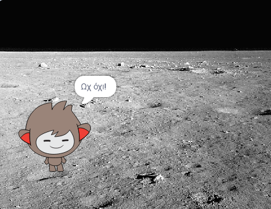

## Λαμβάνοντας αποφάσεις

Μπορείς να προγραμματίσεις το chatbot για να αποφασίσει τι να κάνει με βάση τις απαντήσεις που λαμβάνει.

Αρχικά, θα κάνεις το chatbot να ρωτήσει μία ερώτηση που μπορεί να απαντηθεί με "ναι" ή "όχι".

\--- task \---

Άλλαξε τον κώδικα του chatbot. Το chatbot θα πρέπει να ρωτήσει την ερώτηση "Είσαι καλά όνομα", χρησιμοποιώντας τη μεταβλητή `όνομα`{:class="block3variables"}. Μετά θα πρέπει να απαντήσει "Χαίρομαι που το ακούω!" `αν`{:class="block3control"} η απάντηση που λαμβάνει είναι "ναι", αλλά να μην πει τίποτα αν η απάντηση είναι "όχι".


```blocks3
when this sprite clicked
ask [What's your name?] and wait
set [name v] to (answer)
say (join [Hi ] (name)) for (2) seconds
+ask (join [Are you OK ] (name)) and wait
+if <(answer) = [yes]> then 
  say [That's great to hear!] for (2) seconds
end
```

Για να δοκιμάσεις κατάλληλα το νέο σου κώδικα, πρέπει να το δοκιμάσεις **δύο φορές**, μία φορά με την απάντηση "ναι" και μία φορά με την απάντηση "όχι".

\--- /task \---

Προς το παρόν, το chatbot σου δεν λέει τίποτα στην απάντηση "όχι".

\--- task \---

Αλλάξτε τον κώδικα του chatbot σου έτσι ώστε να απαντά "Ωχ όχι!" εάν λάβει "όχι" ως απάντηση στην ερώτηση "Είστε OK όνομα".

Replace the `if, then`{:class="block3control"} block with an `if, then, else`{:class="block3control"} block, and include code so the chatbot can `say "Oh no!"`{:class="block3looks"}.


```blocks3
when this sprite clicked
ask [What's your name?] and wait
set [name v] to (answer)
say (join [Hi ] (name)) for (2) seconds
ask (join [Are you OK ] (name)) and wait

+ if <(answer) = [yes]> then 
  say [That's great to hear!] for (2) seconds
else 
+  say [Oh no!] for (2) seconds
end
```

\--- /task \---

\--- task \---

Δοκίμασε τον κώδικά σοτ Θα λάβεις μία διαφορετική απάντηση όταν απαντάς "όχι" και όταν απαντάς "ναι": το chatbot σου θα απαντάει "Χαίρομαι που το ακούω" όταν απαντάς "ναι" (έχουν σημασία τα μικρά γράμματα) και θα απαντάει "Ωχ όχι!" όταν απαντάς **ο,τιδήποτε άλλο**.




\--- /task \---

You can put any code inside an `if, then, else`{:class="block3control"} block, not just code to make your chatbot speak!

If you click your chatbot's **Costumes** tab, you'll see that there is more than one costume.


\--- task --

Change your chatbot's code so that the chatbot switches costumes when you type in your answer.


Change the code inside the `if, then, else`{:class="block3control"} block to `switch costume`{:class="block3looks"}.


```blocks3
when this sprite clicked
ask [What's your name?] and wait
set [name v] to (answer)
say (join [Hi ] (name)) for (2) seconds
ask (join [Are you OK ] (name)) and wait
if <(answer) = [yes]> then 

+  switch costume to (nano-c v)
  say [That's great to hear!] for (2) seconds
else 
+  switch costume to (nano-d v)
  say [Oh no!] for (2) seconds
end
```

Test and save your code. You should see your chatbot's face change depending on your answer.

\--- /task \---

Have you noticed that, after your chatbot's costume has changed, it stays like that and doesn't change back to what it was at the beginning?

You can try this out: run your code and answer "no" so that your chatbot's face changes to an unhappy look. Then run your code again and notice that your chatbot does not change back to looking happy before it asks your name.


\--- task --

To fix this problem, add to the chatbot's code to `switch costume`{:class="block3looks"} at the start `when the sprite is clicked`{:class="block3events"}.


```blocks3
when this sprite clicked

+ switch costume to (nano-a v)
ask [What's your name?] and wait
```


\--- /task \---