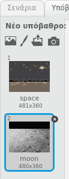
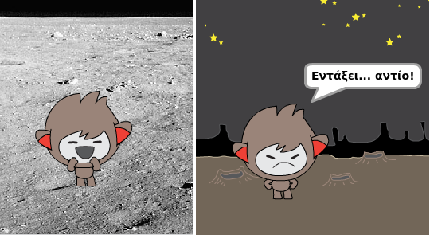
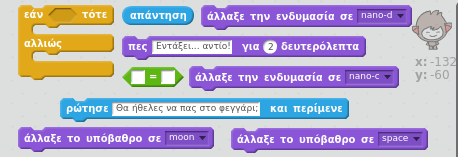
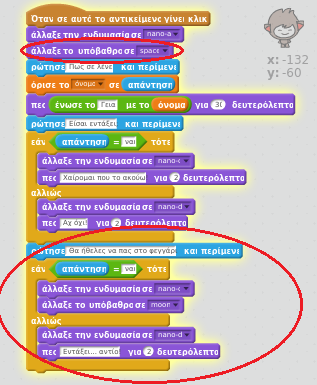
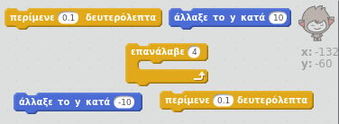
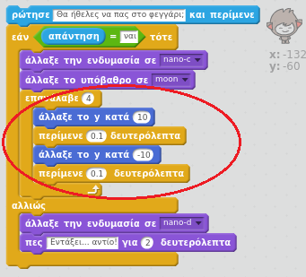

## Αλλάζοντας τοποθεσία

Μπορείς επίσης να γράψεις κώδικα ώστε το chatbot να αλλάζει τοποθεσία.

--- task ---

Πρόσθεσε ένα άλλο υπόβαθρο στο Σκηνικό σου, για παράδειγμα το 'moon'.

--- /task ---

--- task ---

Μπορείς να προγραμματίσεις το chatbot να ρωτά "Θα ήθελες να πας στο φεγγάρι;" και στη συνέχεια να αλλάζει τοποθεσία αν απαντήσεις "ναι";

Δοκίμασε και αποθήκευσε. Εάν απαντήσεις "ναι", το chatbot θα πρέπει να αλλάζει τοποθεσία. Το chatbot θα πρέπει να φαίνεται λυπημένο και να λέει "Εντάξει... αντίο!" αν δοθεί όποια άλλη απάντηση.

--- hints --- --- hint --- Το chatbot πρέπει να **ρωτά** «Θα θέλατε να πάτε στο φεγγάρι;». **Εάν** η **απάντησή** σου είναι "ναι", τότε το chatbot θα πρέπει να **αλλάζει ενδυμασία** για να φαίνεται ευτυχισμένο καθώς επίσης θα πρέπει να αλλάζει και το **υπόβαθρο**.

Εάν απαντήσεις "όχι", το chatbot θα πρέπει να **αλλάζει ενδυμασία** για να φαίνεται λυπημένο και **να πει** "Εντάξει... αντίο!"

Θα χρειαστείς επίσης να προσθέσεις κώδικα για να ξεκινά το chatbot από τη σωστή θέση **όταν πατηθεί**. --- /hint --- --- hint --- Εδώ είναι τα μπλοκ κώδικα που θα χρειαστείς:  --- /hint --- --- hint --- Έτσι πρέπει να είναι ο κώδικάς σου:  --- /hint --- --- /hints ---

--- /task ---

--- task ---

Μπορείς να προσθέσεις κώδικα για να κάνεις το chatbot να πηδά από χαρά αν του πεις ότι θέλεις να πας στο φεγγάρι;

Δοκίμασε και αποθήκευσε. Εάν απαντήσεις "ναι", το chatbot πρέπει να πηδά πάνω κάτω. Το chatbot δεν πρέπει να πηδά αν δοθεί όποια άλλη απάντηση.

--- hints --- --- hint --- Το chatbot πρέπει να αναπηδά **αλλάζοντας** τη **συντεταγμένη y** κατά μία μικρή τιμή και στη συνέχεια να επανέρχεται στη θέση του μετά από μια σύντομη **αναμονή**. Μπορείς αν θες να **επαναλάβεις** αυτό μερικές φορές. --- /hint --- --- hint --- Εδώ είναι τα μπλοκ κώδικα που θα χρειαστείς:  --- /hint --- --- hint --- Έτσι πρέπει να είναι ο κώδικάς σου:  --- /hint --- --- /hints ---

--- /task ---
