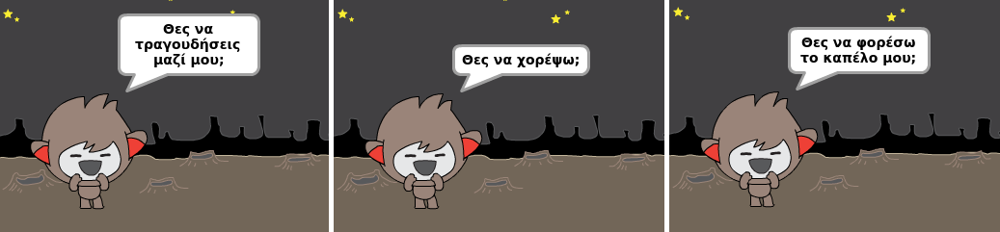

--- challenge ---

## Πρόκληση: ολοκλήρωσε το chatbot σου

Χρησιμοποίησε αυτά που έχεις μάθει για να ολοκληρώσεις τη δημιουργία του διαδραστικού chatbot σου. Ακολουθούν μερικές ιδέες:

Αφού τελειώσεις με το chatbot, πες στους φίλους σου να συνομιλήσουν μαζί του! Τους άρεσε ο χαρακτήρας σου; Διαπίστωσαν κάποια προβλήματα; --- /challenge ---
***
### Κοινοτική συνεισφορά μετάφρασης

Το έργο αυτό μεταφράστηκε από **Γιώργος Νικολαΐδης** και αναθεωρήθηκε από **Ioannis Petropoulos/Δήμητρα Θεοδώρου**. 

Οι εκπληκτικοί μας εθελοντές-μεταφραστές μας βοηθούν να δώσουμε στα παιδιά όλου του κόσμου την ευκαιρία να μάθουν να προγραμματίζουν. Μπορείτε να μας βοηθήσετε να προσεγγίσουμε περισσότερα παιδιά μεταφράζοντας τα έργα μας - διαβάστε περισσότερα στο [rpf.io/translators](https://rpf.io/translators).
