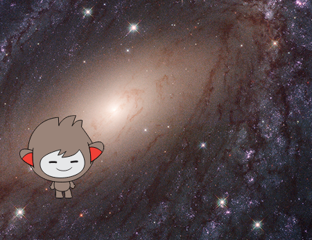

## Αλλάζοντας τοποθεσία

Μπορείς επίσης να προγραμματίσεις το chatbot να αλλάζει τοποθεσία!



--- task ---

Μπορείς να προγραμματίσεις το chatbot να ρωτά "Θα ήθελες να πας στο φεγγάρι;" και στη συνέχεια να αλλάζει τοποθεσία, εάν απαντήσεις "ναι";

--- hints ---


--- hint ---

Το chatbot σου πρέπει να `ρωτήσει "Θέλεις να πας στο διάστημα;"`{:class="block3sensing"} και `εάν`{:class="block3control"} `απαντήσεις`{:class="block3sensing"} "ναι", θα πρέπει `να αλλάξει το σκηνικό στο διάστημα`{:class="block3looks"}.

--- /hint ---

--- hint ---

Ακολουθούν τα μπλοκ κώδικα που πρέπει να προσθέσεις στον κώδικα του chatbot.


```blocks3
άλλαξε υπόβαθρο σε (Galaxy v)

ρώτησε [Θέλεις να πας στο διάστημα;] και περίμενε

εάν <(απάντηση) = [ναι]> τότε
end
```

--- /hint ---

--- hint ---

Έτσι πρέπει να μοιάζει ο κώδικάς σου:

```blocks3
ρώτησε [Θέλεις να πας στο διάστημα;] και περίμενε
εάν <(απάντηση) = [ναι]> τότε 
  άλλαξε υπόβαθρο σε (Galaxy v)
end
```

--- /hint ---

--- /hints ---

--- /task ---

--- task ---

Τώρα χρειάζεται να βεβαιωθείς ότι το chatbot σου ξεκινά στη σωστή τοποθεσία, όταν κάνεις κλικ σε αυτό για να του μιλήσεις. Πρόσθεσε αυτό το μπλοκ στην αρχή του κώδικα του chatbot:


```blocks3
όταν γίνει κλικ σε αυτό το αντικείμενο

+ άλλαξε υπόβαθρο σε (space v)
```

--- /task ---

--- task ---

Δοκίμασε το πρόγραμμά σου και απάντησε "ναι", όταν το chatbot σου ρωτήσει εάν θέλεις να πας στο φεγγάρι. Θα δεις ότι η τοποθεσία του chatbot αλλάζει.

--- /task ---

--- task ---

Μπορείς επίσης να προσθέσεις τον ακόλουθο κώδικα στο νέο μπλοκ `εάν`{:class="block3control"} για να κάνεις το chatbot να αναπηδήσει τέσσερις φορές ,εάν απαντήσεις "ναι":


```blocks3
εάν <(απάντηση) = [ναι]> τότε 
  άλλαξε υπόβαθρο σε (moon v)
  + επανάλαβε (4) 
  +   άλλαξε y κατά (10)
  +   περίμενε (0.1) δευτερόλεπτα
  +   άλλαξε y κατά (-10)
  +   περίμενε (0.1) δευτερόλεπτα
  + end
end
```

--- /task ---