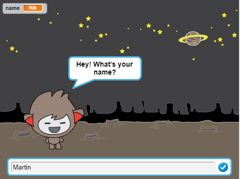

## Introduction

You are going to learn how to program a character that can talk to you! A character like that is called a chat robot, or chatbot.

### What you will make

--- no-print ---

Click on the green flag, and then click on the chatbot character to start a conversation. When the chatbot asks a question, type your answer into the box at the bottom of the Stage, and then click on the blue mark on the right (or press `Enter`) to see the chatbot's reply.

  <iframe allowtransparency="true" width="485" height="402" src="https://scratch.mit.edu/projects/embed/248864190/?autostart=false" frameborder="0" scrolling="no"></iframe>

--- /no-print ---

--- print-only ---

--- /print-only ---

## What you will need

Scratch 3 (either [online](https://rpf.io/scratchon){:target="_blank"} or [offline](https://rpf.io/scratchoff){:target="_blank"})

### Downloads
+ [Find files to download here](https://rpf.io/p/en/chatbot-go){:target="_blank"}

--- collapse ---
---
title: Additional notes for educators
---

If you need to print this project, please use the [printer-friendly version](https://projects.raspberrypi.org/en/projects/chatbot/print){:target="_blank"}.

You can find the [completed project here](https://rpf.io/p/en/chatbot-get){:target="_blank"}.

--- /collapse ---
