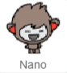

## A talking chatbot

Now that you have a chatbot with a personality, you're going to program it to talk to you.

--- task ---

Click on your chatbot sprite, and add this code to it so that `when it's clicked`{:class="block3events"}, it `asks for your name`{:class="block3sensing"} and then `says "What a lovely name!"`{:class="block3looks"}.


```blocks3
when this sprite clicked
ask [What's your name?] and wait
say [What a lovely name!] for (2) seconds
```

--- /task ---

--- task ---

Click on your chatbot to test your code. When the chatbot ask for your name, type it into the box that appears at the bottom of the Stage, and then click on the blue mark, or press <kbd>Enter</kbd>.


--- /task ---

--- task ---

Right now, your chatbot replies "What a lovely name!" every time you answer. You can make the chatbot’s reply more personal, so that the reply is different every time a different name is typed in.

Change the chatbot sprite’s code to `join`{:class="block3operators"} "Hi" with the `answer`{:class="block3sensing"} to the "What's your name?" question, so that the code looks like this:


```blocks3
when this sprite clicked
ask [What's your name?] and wait
say (join [Hi ] (answer) :: +) for (2) seconds
```


--- /task ---

--- task ---

By storing the answer in a **variable**, you can use it anywhere your project.

Create a new variable called `name`{:class="block3variables"}.

[[[generic-scratch3-add-variable]]]

--- /task ---

--- task ---

Now, change your chatbot sprites’s code to set the `name`{:class="block3variables"} variable to `answer`{:class="block3sensing"}:


```blocks3
when this sprite clicked
ask [What's your name?] and wait
+ set [name v] to (answer)
say (join [Hi ] (name :: variables +)) for (2) seconds
```

Your code should work as before: your chatbot should say hi using the name you type in.


--- /task ---

Test your program again. Notice that the answer you type in is stored in the `name`{:class="block3variables"} variable, and is also shown in the top left-hand corner of the Stage. To make it disappear from the Stage, go to the `Data`{:class="block3variables"} blocks section and click on the box next to `name`{:class="block3variables"} so that it is not marked.

