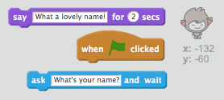
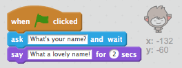
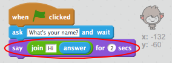
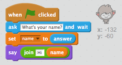

# Step 2: A talking ChatBot

Now that you have a ChatBot with a personality, let's program it to talk to you.

+ Add code to your ChatBot so that when it's clicked it asks for your name, and then says "What a lovely name!".

### Hint 1
{: .hint-heading #hint-1 }
When the ChatBot__sprite is clicked__, it should __ask__ for your name. The ChatBot should then __say__ "What a lovely name!".
{: .hint-content .hint-1 }

### Hint 2
{: .hint-heading #hint-2 }
Here are the code blocks you'll need:

{: .hint-content .hint-2 }

### Hint 3
{: .hint-heading #hint-3 }
Here's how your code should look:

{: .hint-content .hint-3 }

### Save your project

+ Your chatbot simply replies "What a lovely name!" every time. Can you personalise your chatbot's reply, by making use of the user's answer?

    Test and save: Your ChatBot should say hello using the user's name.

    

### Hint 1
{: .hint-heading #hint-1 }
When the ChatBot __sprite is clicked__, it should __ask__ for your name. The ChatBot should then __say__ "Hi", followed by the user's __answer__.
{: .hint-content .hint-1 }

### Hint 2
{: .hint-heading #hint-2 }
Here are the code blocks you'll need:

{: .hint-content .hint-2 }

### Hint 3
{: .hint-heading #hint-3 }
Here's how your code should look:

{: .hint-content .hint-3 }

+ If you store the user's answer in a variable, then it can be used later. Create a new variable called `name` to store the user's name.

##### 'Creating a new Scratch variable' ingredient (collapsable).
[[[scratch-add-variable]]]

+ Can you store the user's answer in your `name` variable, and use it in your ChatBot's reply?

    Save and test: Your code should work as before, saying hello using the user's name.

    

### Hint 1
{: .hint-heading #hint-1 }
When the ChatBot__sprite is clicked__, it should __ask__ for your name. You should then __set__ your __name__ variable to the user's __answer__. The ChatBot should then __say__ "Hi", followed by the user's __name__.
{: .hint-content .hint-1 }

### Hint 2
{: .hint-heading #hint-2 }
Here are the code blocks you'll need:

{: .hint-content .hint-2 }

### Hint 3
{: .hint-heading #hint-3 }
Here's how your code should look:

{: .hint-content .hint-3 }

+ If you'd rather not see the variables on your stage, you can click the tick next to the variable names in the 'Scripts' tab to hide them.

    

## Challenge: More questions { .challenge }

Program your chatbot to ask another question. Can you store their answer in a variable?

