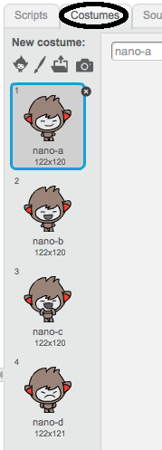

## Making decisions

You can program your chatbot to decide what to do based on the answers it receives.

First, you're going to make your chatbot ask a question that can be answered with "yes" or "no".

--- task ---

Change your chatbot's code. Your chatbot should ask the question "Are you OK name", using the `name`{:class="blockdata"} variable. Then it should reply "That's great to hear!" `if`{:class="blockcontrol"} the answer it receives is "yes", but say nothing if the answer is "no".


```blocks
when this sprite clicked
ask [What's your name?] and wait
set [name v] to (answer)
say (join [Hi ] (name)) for (2) secs
ask (join [Are you OK ] (name)) and wait
if <(answer) = [yes]> then 
  say [That's great to hear!] for (2) secs
end
```

To test your new code properly, you should test it __twice__: once with the answer "yes", and once with the answer "no".

--- /task ---

At the moment, your chatbot doesn't doesn't say anything to the answer "no".

--- task ---

Change your chatbot's code so that it replies "Oh no!" if it receives "no" as the answer to "Are you OK name".

Replace the `if, then`{:class="blockcontrol"} block with an `if, then, else`{:class="blockcontrol"} block, and include code so the chatbot can `say "Oh no!"`{:class="blocklooks"}.


```blocks
when this sprite clicked
ask [What's your name?] and wait
set [name v] to (answer)
say (join [Hi ] (name)) for (2) secs
ask (join [Are you OK ] (name)) and wait
if <(answer) = [yes]> then 
  say [That's great to hear!] for (2) secs
else 
  say [Oh no!] for (2) secs
end
```

--- /task ---


--- task ---

Test your code. You should get a different response when you answer "no" and when you answer "yes": your chatbot should reply with "That’s great to hear!" when you answer "yes" (which is not case-sensitive), and reply with "Oh no!" when you answer **anything else**.


--- /task ---

You can put any code inside an `if, then, else`{:class="blockcontrol"} block, not just code to make your chatbot speak!

If you click your chatbot's **Costume** tab, you'll see that there is more than one costume.



--- task ---

Change your chatbot's code so that the chatbot switches costumes when you type in your answer.


Change the code inside the `if, then, else`{:class="blockcontrol"} block to `switch costume`{:class="blocklooks"}.


```blocks
when this sprite clicked
ask [What's your name?] and wait
set [name v] to (answer)
say (join [Hi ] (name)) for (2) secs
ask (join [Are you OK ] (name)) and wait
if <(answer) = [yes]> then 
  switch costume to [nano-c v]
  say [That's great to hear!] for (2) secs
else 
  switch costume to [nano-d v]
  say [Oh no!] for (2) secs
end
```

Test and save your code. You should see your chatbot's face change depending on your answer.


--- /task ---

Have you noticed that, after your chatbot's costume has changed, it stays like that and doesn't change back to what it was at the beginning? 

You can try this out: run your code and answer "no" so that your chatbot's face changes to an unhappy look. Then run your code again and notice that your chatbot does not change back to looking happy before it asks your name.


--- task ---

To fix this problem, add to the chatbot's code to `switch costume`{:class="blocklooks"} at the start `when the sprite is clicked`{:class="blockevents"}.


```blocks
when this sprite clicked
switch costume to [nano-b v]
ask [What's your name?] and wait
```


--- /task ---

