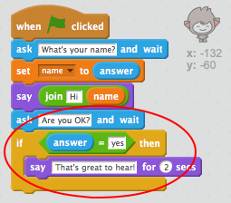
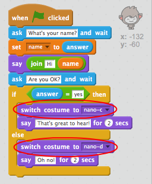
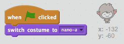

## Step 3: Making decisions

You can program your ChatBot to decide what to say or do, based on the user's responses.

+ Ask the user another question "Are you OK?", and code your ChatBot to reply "That's great to hear!" only __if__ the user answers "yes".

    Test and save: To test your new code properly, you should test it __twice__, once answering "yes", and once answering "no".

    Your ChatBot should reply "That's great to hear!" if you answer "yes", but say nothing if you answer "no".

    

--- hints ---
--- hint ---
After your ChatBot has said "Hi", it should now also __ask__ "Are you OK?". __If__ the user answers "yes" then the ChatBot should __say__ "That's great to hear!".
--- /hint ---
--- hint ---
Here are the extra code blocks you'll need:

--- /hint ---
--- hint ---
Here's how your code should look:

--- /hint ---
--- /hints ---

+ The trouble with your chatbot is that it doesn't give a reply if the user answers "no". Can you change your ChatBot so that it also replies "Oh no!" if you answer "no" to the question?

    Test and save: Your ChatBot should now say "Oh no!" if you answer "no". In fact, it will say "On no!" if you answer with anything other than "yes" (the __else__ in an if/else block means __otherwise__).

    

--- hints ---
--- hint ---
Your ChatBot should now say "That's great to hear!" __If__ the user answers "yes", but should say "Oh no!" if the user answers something __else__.
--- /hint ---
--- hint ---
Here are the code blocks you'll need to use:

--- /hint ---
--- hint ---
Here's how your code should look:

--- /hint ---
--- /hints ---

+ You can put any code inside an `if` or `else` block, not just code to make your chatbot speak. If you click your ChatBot's 'costume' tab, you'll see that there is more than one.

    

+ Can you change the ChatBot's costume to match the response?

    Test and save: You should see your ChatBot's face change, depending on the user's answer.

    

--- hints ---
--- hint ---
Your ChatBot should now also __switch costume__ depending on the answer given.
--- /hint ---
--- hint ---
Here are the code blocks you'll need to use:

--- /hint ---
--- hint ---
Here's how your code should look:

--- /hint ---
--- /hints ---

+ Have you noticed that your ChatBot's costume stays the same as the last time you spoke to it? Can you fix this problem?

    

    Test and save: Run your code and type "no", so that your ChatBot looks unhappy. When you run your code again, your ChatBot should change back to a smiling face before asking your name.

    

--- hints ---
--- hint ---
When the __sprite is clicked__, your ChatBot should first __switch costume__ to a smiling face.
--- /hint ---
--- hint ---
Here's the code block you'll need to add:

--- /hint ---
--- hint ---
Here's how your code should look:

--- /hint ---
--- /hints ---

--- challenge ---
## Challenge: More decisions

Program your chatbot to ask another question - something with a "yes" or "no" answer. Can you make your ChatBot respond to the answer?

--- /challenge ---
