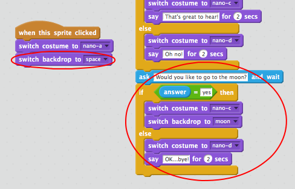
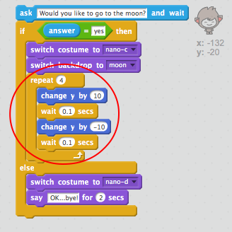

## Step 4: Changing location

You can also code your chatbot to change its location.

+ Add another backdrop to your stage, for example the 'moon' backdrop.

	

--- collapse ---
---
title: Adding a backdrop from the Scratch library
image: images/image.png
---
[[[backdrop-from-library]]]
--- /collapse ---

+ Can you code your ChatBot to ask "Would you like to go to the moon?" and then change location if the user answers "yes"?

    Test and save: If you answer "yes", your ChatBot should change location. Your ChatBot should look sad and say "OK... bye!" if any other answer is given.

    

--- hints ---
--- hint ---
Your ChatBot should __ask__ the user "Would you like to go to the moon?". __If__ the user's __answer__ is "yes" then your ChatBot should __change costume__ to look happy and the stage __backdrop__ should change.

If the user answers "no", the ChatBot should __change costume__ to look sad and __say__ "OK...bye!"

You'll also need to add code to start your ChatBot in the right place when the __flag is clicked__.
--- /hint ---
--- hint ---
Here are the code blocks you'll need to use:

--- /hint ---
--- hint ---
Here's how your code should look:

--- /hint ---
--- /hints ---

+ Can you add code to make your ChatBot jump for joy if the user wants to go to the moon?

    Test and save: If your user answers "yes", your ChatBot should jump up and down. Your ChatBot shouldn't jump if any other answer is given.

    

--- hints ---
--- hint ---
Your ChatBot should jump by __changing__ its __y position__ by a small amount, and then changing its position back after a short __wait__. You may want to __repeat__ this a few times.
--- /hint ---
--- hint ---
Here are the code blocks you'll need to use:

--- /hint ---
--- hint ---
Here's how your code should look:

--- /hint ---
--- /hints ---
