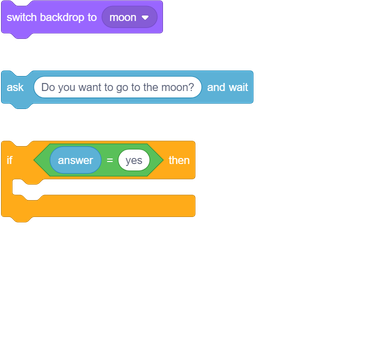
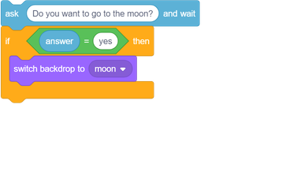
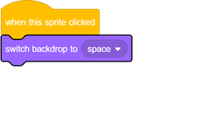
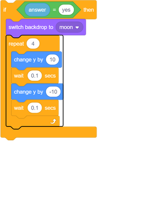

## Changing location

You can also program your chatbot to change its location!

--- task ---

Can you program your chatbot to ask "Do you want to go to the moon", and then change the backdrop when the answer is "yes"?

--- hints ---

--- hint ---

Your chatbot should `ask "Do you want to go to the moon?"`{:class="block3sensing"}, and `if`{:class="block3control"} you `answer`{:class="block3sensing"} "yes", it should `switch the backdrop to the moon`{:class="block3looks"}.

--- /hint ---

--- hint ---

Here are the code blocks you need to add to your chatbot code.

--- /hint ---

--- hint ---

This is what your code should look like:

--- /hint ---

--- /hints ---

--- /task ---

--- task ---

Now you need to make sure that your chatbot starts in the right location when you click on it to talk to it. Add this block to the top of your chatbot code:

--- /task ---

--- task ---

Test your program, and answer "yes" when the chatbot asks if you want to go to the moon. You should see that the chatbot’s location changes.

--- /task ---

--- task ---

You can also add the following code inside the new `if`{:class="block3control"} block to make the chatbot jump up and down four times if you answer "yes":

--- /task ---
