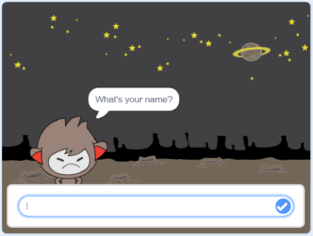

## Paso 3: Tomando decisiones

Puedes programar tu chatbot para que decida qué decir o hacer en función de tus respuestas a sus preguntas.

\--- task \---

¿Puedes hacer que el chatbot haga la pregunta "¿Estás bien?" y añadir código para que responda "¡Esto es estupendo!" solo **si** el usuario responde "sí"?

Para probar tu nuevo código correctamente, debes probarlo **dos veces**, una vez con la respuesta "sí", y una con la respuesta "no".

Tu chatbot debería responder "¡Esto es estupendo!" si respondes "sí", pero no decir nada si respondes "no".

\--- hints \--- \--- hint \--- Después de que tu chatbot haya dicho "hola", ahora también debería **preguntar** "¿Estas bien?". **Si** tu respuesta es "sí", entonces el chatbot debe **decir** "¡Esto es estupendo!". \--- /hint \--- \--- hint \--- Estos son los bloques de código extra que vas a necesitar:  \--- /hint \--- \--- hint \--- Tu código debería quedar así:  \--- /hint \--- \--- /hints \---

\--- /task \---

\--- task \---

De momento, tu chatbot no dice nada si respondes "no". ¿Puedes cambiar tu chatbot para que también responda "¡Oh, no!" si respondes "no" a su pregunta?

Prueba y guarda. Tu chatbot ahora debería decir "¡Oh, no!" si respondes "no". De hecho, dirá "¡Oh no!" si respondes con algo que no sea "sí" (el **si no** en un bloque `si/si no` significa **en caso contrario**).

\--- hints \--- \--- hint \--- Tu chatbot debería decir "Esto es estupendo!" **si** tu respuesta es "si", pero debería decir "Oh no!" si contestas otra cosa.**si no**. \--- /hint \--- \--- hint \--- Here are the code blocks you'll need to use:  \--- /hint \--- \--- hint \--- Here's how your code should look:  \--- /hint \--- \--- /hints \---

\--- /task \---

\--- task \---

You can put any code inside an `if/else` block, not just code to make your chatbot speak. If you click your chatbot's **Costume** tab, you'll see that it has more than one costume.

\--- /task \---

\--- task \---

Can you change the chatbot's costume to match your response?

Test and save. You should see your chatbot's face change depending on your answer.

\--- hints \--- \--- hint \--- Your chatbot should now also **switch costume** depending on the answer given. \--- /hint \--- \--- hint \--- Here are the code blocks you'll need to use:  \--- /hint \--- \--- hint \--- Here's how your code should look:  \--- /hint \--- \--- /hints \---

\--- /task \---

\--- task \---

Have you noticed that your chatbot's costume stays the same that it changed to the last time you spoke to it? Can you fix this problem?

Test and save: Run your code and type "no", so that your chatbot looks unhappy. When you run your code again, your chatbot should change back to a smiling face before asking your name.

\--- hints \--- \--- hint \--- When the **sprite is clicked**, your chatbot should first **switch costume** to a smiling face. \--- /hint \--- \--- hint \--- Here's the code block you'll need to add:  \--- /hint \--- \--- hint \--- Here's how your code should look:  \--- /hint \--- \--- /hints \---

\--- /task \---

\--- challenge \---

## Challenge: more decisions

Program your chatbot to ask another question - something with a "yes" or "no" answer. Can you make your chatbot respond to the answer?

 \--- /challenge \---