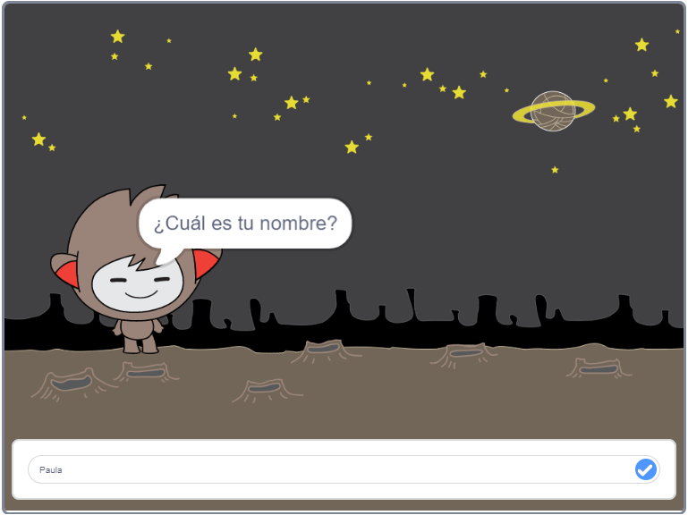

\--- no-print \---

Esta es la versión ** Scratch 3 ** del proyecto. También hay una versión [ Scratch 2 del proyecto. ](https://projects.raspberrypi.org/en/projects/chatbot-scratch2).

\--- /no-print \---

## Introducción

¡Vas a aprender cómo programar un personaje que puede hablar contigo! Este tipo de personaje se llama robot de chat, o chatbot.

### Lo que crearás

\--- no-print \---

Haz clic en la bandera verde y después haz clic en el chatbot para iniciar una conversación. Cuando el chatbot haga una pregunta, escribe tu respuesta en el cuadro de la parte inferior del escenario y haz clic en la marca azul de la derecha (o presiona `Enter`) para ver la respuesta del chatbot.

  <iframe allowtransparency="true" width="485" height="402" src="https://scratch.mit.edu/projects/embed/248864190/?autostart=false" 
  frameborder="0" scrolling="no"></iframe>

\--- /no-print \---

\--- print-only \---

\--- /print-only \---

## \--- collapse \---

## title: What you will need

### Hardware

- Ordenador capaz de ejecutar Scratch 3

### Software

- Scratch 3 (tanto [online](https://rpf.io/scratchon) como [offline](https://rpf.io/scratchoff))

### Descargas

- [ Encuentra los archivos a descargar aquí ](http://rpf.io/p/en/chatbot-go).

\--- /collapse \---

## \--- collapse \---

## title: What you will learn

- Usa el código para concatenar cadenas en Scratch
- Saber que las variables pueden ser usadas para almacenar la entrada de un usuario
- Use conditional selection to respond to user input in Scratch

\--- /collapse \---

## \--- collapse \---

## title: Additional notes for educators

\--- no-print \---

If you need to print this project, please use the [printer-friendly version](https://projects.raspberrypi.org/en/projects/chatbot/print){:target="_blank"}.

\--- /no-print \---

You can find the [completed project here](http://rpf.io/p/en/chatbot-get).

\--- /collapse \---