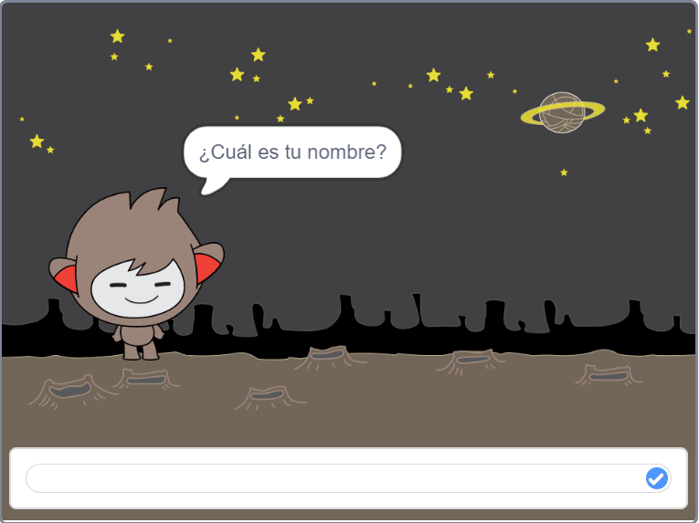
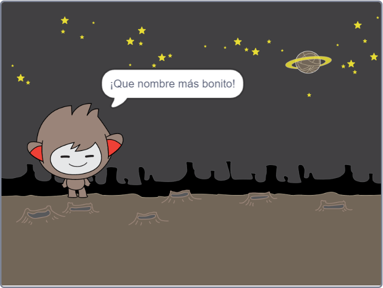
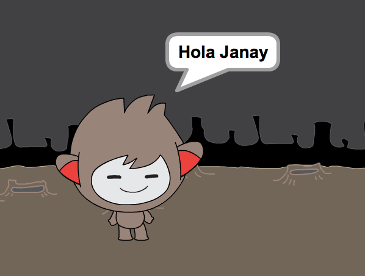

## Un chatbot parlanchín

Ahora que tienes un chatbot con personalidad, vas a programarlo para que hable contigo.

\--- task \---

Haz clic en el objeto de tu chatbot y añade este código para que `cuando hagas clic en él`{:class="block3events"}, `te pregunte tu nombre`{:class="block3sensing"} y luego `diga "¡Qué nombre más bonito!"`{:class="block3looks"}.


```blocks3
al hacer click en este sprite
preguntar [¿Cuál es tu nombre?] y esperar
decir [¡Que nombre más bonito!] durante (2) segundos
```

\--- /task \---

\--- task \---

Haz clic en tu chatbot para probar tu código. Cuando el chatbot pida tu nombre, escríbelo en el cuadro que aparece en la parte inferior del escenario, y luego haz clic en la marca de verificación azul, o pulsa <kbd> Enter </kbd>.





\--- /task \---

\--- task \---

Ahora mismo, tu chatbot contesta "¡Qué nombre más bonito!" cada vez que respondes. Puedes hacer que la respuesta del chat sea más personal, de forma que la respuesta sea diferente cada vez que se escriba un nombre distinto.

Cambia el código del sprite de tu chatbot a `unir`{:class="block3operators"} "Hola" con la `respuesta`{:class="block3sensing"} a la pregunta "¿Cómo te llamas?", de modo que el código se parezca a esto:


```blocks3
al hacer click en este sprite
preguntar [¿Cuál es tu nombre?] y esperar
decir (unir [Hola ] (respuesta):: + ) durante (2) segundos
```



\--- /task \---

\--- task \---

Almacenando la respuesta en una **variable**, puedes usarla en cualquier lugar del proyecto.

Crea una nueva variable llamada `nombre`{:class="block3variables"}.

[[[generic-scratch3-add-variable]]]

\--- /task \---

\--- task \---

Ahora, cambia el código del sprite de tu chatbot para asignar en el valor de la variable `nombre`{:class="block3variables"} la `respuesta`{:class="block3sensing"}:


```blocks3
al hacer click en este sprite
preguntar [¿Cuál es tu nombre?] y esperar
dar a [nombre] el valor (respuesta)
decir (unir [Hola ] (nombre) ) durante (2) segundos
```

Tu código debería funcionar como antes: tu chatbot debería decir hola usando el nombre que escribiste.


\--- /task \---

Prueba tu programa de nuevo. Ten en cuenta que la respuesta que escribes está almacenada en la variable `nombre`{:class="block3variables"}, y también se muestra en la esquina superior izquierda del Escenario. Para que desaparezca del Escenario, ve a `Variables`{:class="block3variables"} en la sección de los bloques y haz clic en la caja junto a `nombre`{:class="block3variables"} para que quede desmarcada.