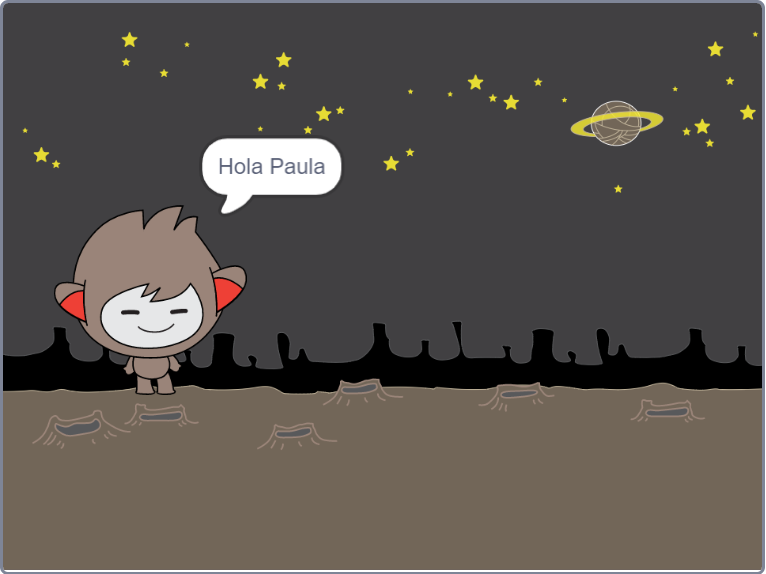

## Un chatbot parlanchín

Ahora que tienes un chatbot con personalidad, vamos a programarlo para que hable contigo.

\--- task \---

Agrega código a tu chatbot para que cuando se haga clic en él, te pida tu nombre y luego diga "¡Qué nombre más bonito!"

\--- hints \--- \--- hint \--- Cuando se haga **clic en la figura** del chatbot, debería **preguntarte** por tu nombre. Luego el chatbot debería **decir** "Que nombre más bonito!" \--- /hint \--- \--- hint \--- Estos son los bloques de código que vas a necesitar:  \--- /hint \--- \--- hint \--- Este debería ser el aspecto de tu código:  \--- /hint \--- \--- /hints \---

\--- /task \---

\--- task \---

Ahora el chatbot simplemente responde "¡Qué nombre más bonito!" cada vez. ¿Puedes personalizar la respuesta de tu chatbot haciendo uso de tu respuesta?

\--- hints \--- \--- hint \--- When the chatbot **sprite is clicked**, it should **ask** for your name. The chatbot should then **say** "Hi", followed by your **answer**. \--- /hint \--- \--- hint \--- Here are the code blocks you'll need:  \--- /hint \--- \--- hint \--- Here's how your code should look:  \--- /hint \--- \--- /hints \---

\--- /task \---

\--- task \---

If you store your answer in a **variable**, then it can be used later. Create a new variable called `name` to store your name.

[[[generic-scratch-add-variable]]]

\--- /task \---

\--- task \---

Can you store your answer in the `name` variable and use it in your chatbot's reply?

Your code should work as before: your chatbot should say hello using your name.

\--- hints \--- \--- hint \--- When the chatbot **sprite is clicked**, it should **ask** for your name. You should then **set** the `name` variable to your **answer**. The chatbot should then **say** "Hi", followed by your **name**. \--- /hint \--- \--- hint \--- Here are the code blocks you'll need:  \--- /hint \--- \--- hint \--- Here's how your code should look:  \--- /hint \--- \--- /hints \---

\--- /task \---

\--- challenge \---

## Desafío: más preguntas

Program your chatbot to ask another question. Can you store the answer in a new variable?

 \--- /challenge \---