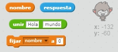

## Un chatbot parlanchín

Ahora que tienes un chatbot con personalidad, vamos a programarlo para que hable contigo.

--- task ---

Agrega código a tu chatbot para que cuando se haga clic en él, te pida tu nombre y luego diga "¡Qué nombre más bonito!"

--- hints --- --- hint --- Cuando se haga **clic en la figura** del chatbot, debería **preguntarte** por tu nombre. Luego el chatbot debería **decir** "Que nombre más bonito!" --- /hint --- --- hint --- Estos son los bloques de código que vas a necesitar:  --- /hint --- --- hint --- Tu código debería quedar así:  --- /hint --- --- /hints ---

--- /task ---

--- task ---

Ahora el chatbot simplemente responde "¡Qué nombre más bonito!" cada vez. ¿Puedes personalizar la respuesta de tu chatbot haciendo uso de tu respuesta?

--- hints --- --- hint --- Cuando se hace **clic en la figura** del chatbot, este debería **preguntarte** por tu nombre. El chatbot debería entonces **decir** "Hola", seguido de tu **respuesta**. --- /hint --- --- hint --- Estos son los bloques de código que vas a necesitar:  --- /hint --- --- hint --- Tu código debería ser así:  --- /hint --- --- /hints ---

--- /task ---

--- task ---

Si guardas tu respuesta en una **variable**, se podrá usar más tarde. Crea una nueva variable llamada `nombre` para guardar tu nombre.

[[[generic-scratch-add-variable]]]

--- /task ---

--- task ---

¿Puedes almacenar tu respuesta en la variable `nombre` y usarla en la respuesta de tu chatbot?

Tu código debería funcionar como antes: tu chatbot debería decir hola usando tu nombre.

--- hints --- --- hint --- Cuando se hace clic **clic en la figura** del chatbot, este debería **preguntar** por tu nombre. Entonces deberías **establecer** la variable `nombre` al contenido de tu **respuesta**. El chatbot debería entonces **decir** "Hola", seguido de tu **nombre**. --- /hint --- --- hint --- Estos son los bloques de código que vas a necesitar:  --- /hint --- --- hint --- Tu código debería quedar así:  --- /hint --- --- /hints ---

--- /task ---

--- challenge ---

## Desafío: más preguntas

Programa tu chatbot para hacer otra pregunta. ¿Puedes almacenar la respuesta en una nueva variable?

 --- /challenge ---
