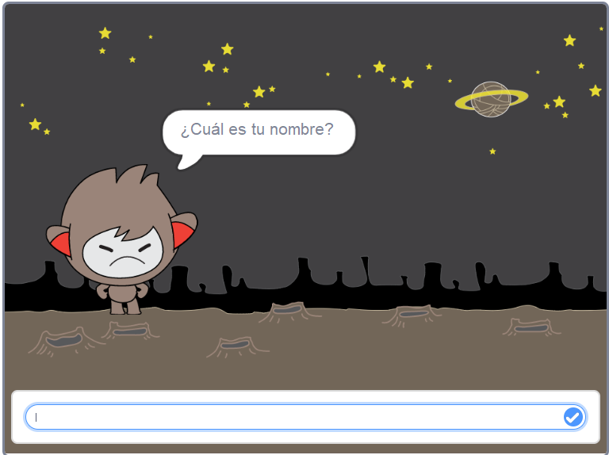
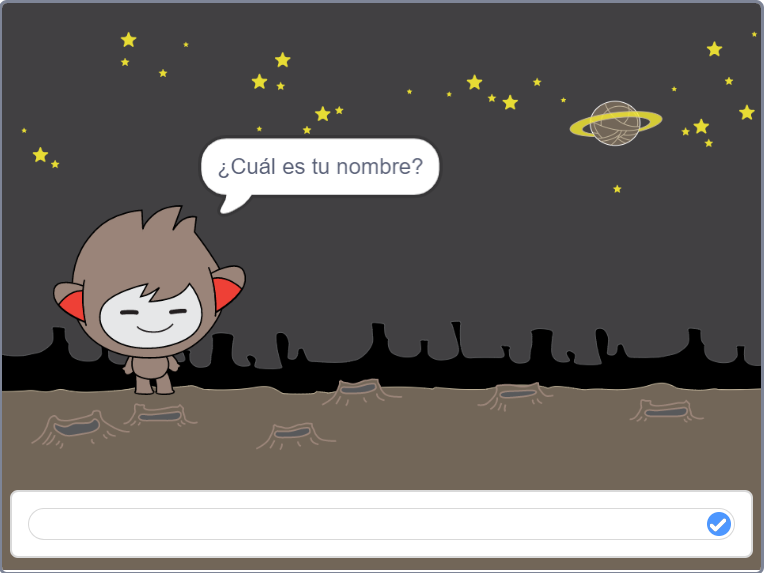

## Tomando decisiones

Puedes programar tu chatbot para que decida qué hacer en función de las respuestas que recibe.

Primero, vas a hacer que tu chatbot haga una pregunta que pueda responderse con "sí" o "no".

\--- task \---

Cambia el código de tu chatbot. Tu chatbot debe hacer la pregunta "Estás bien nombre", usando la variable `nombre`{:class="block3variables"}. Entonces debería responder "¡Me alegra oírlo!" `si`{:class="block3control"} la respuesta que recibe es "sí", pero no decir nada si la respuesta es "no".


```blocks3
al hacer clic en sprite
preguntar [¿Cúal es tu nombre?] y esperar
dar a [nombre v] el valor (respuesta)
decir (unir [Hola] (nombre)) durante (2) segundos
+preguntar (unir [¿Estás bien?,  ] (nombre)) y esperar
+si <(respuesta) = [sí]> entonces 
  decir [¡Me alegra oírlo!] durante (2) segundos
fin
```

Para probar tu nuevo código correctamente, debes probarlo **dos veces **, una vez con la respuesta "sí", y otra con la respuesta "no".

\--- /task \---

At the moment, your chatbot doesn't say anything to the answer "no".

\--- task \---

Cambia el código de tu chatbot para que responda "¡Oh no!" si recibe "no" como respuesta a "¿Estás bien nombre?".

Sustituye el bloque `si, entonces`{:class="block3control"} con un bloque `si, entonces, si no`{:class="block3control"}, e incluye código para que el chatbot pueda `decir "Oh no!"`{:class="block3looks"}.


```blocks3
al hacer clic en sprite
preguntar [¿Cúal es tu nombre?] y esperar
dar a [nombre v] el valor (respuesta)
decir (unir [Hola] (nombre)) durante (2) segundos
+preguntar (unir [¿Estás bien?,  ] (nombre)) y esperar

+ si <(respuesta) = [sí]> entonces 
  decir [¡Me alegra oírlo!] durante (2) segundos
si no 
+  decir [¡Oh no!] durante (2) segundos
fin
```

\--- /task \---

\--- task \---

Prueba tu código. Deberías obtener una respuesta diferente cuando respondes "no" que cuando respondes "sí": tu chatbot debería responder con "¡Me alegra oírlo! cuando respondas "sí" (que no es sensible a mayúsculas/minúsculas), y responder con "¡Oh no!" cuando respondas **cualquier otra cosa**.


\--- /task \---

Puedes poner cualquier código dentro de un bloque `si, entonces, si no`{:class="block3control"}, ¡no solo el código para hacer que tu chatbot hable!

Si haces un clic en la pestaña **Disfraces ** de tu chatbot, verás que tiene más de un disfraz.


\--- task \---

Cambia el código de tu chatbot para que el chatbot cambie de disfraz cuando escribas tu respuesta.


Cambia el código dentro del bloque `si, entonces, si no`{:class="block3control"} a `cambiar disfraz a`{:class="block3looks"}.


```blocks3
al hacer clic en sprite
preguntar [¿Cúal es tu nombre?] y esperar
dar a [nombre v] el valor (respuesta)
decir (unir [Hola] (nombre)) durante (2) segundos
preguntar (unir [¿Estás bien?,  ] (nombre)) y esperar
si <(respuesta)=[si]> entonces

+ cambiar disfraz a (nano-c v)
 decir (¡Me alegra oirlo!) durante (2) segundos
si no
+ cambiar disfraz a (nano-d v)
 decir [¡Oh no!] durante (2) segundos
fin
```

Prueba y guarda tu código. Deberías ver la cara de tu chatbot cambiar según tu respuesta.

\--- /task \---

¿Te has dado cuenta de que, después de que el disfraz de tu chatbot haya cambiado, se mantiene así y no cambia de nuevo a como era al principio?

Puedes probar esto: ejecuta tu código y responde "no" para que la cara de tu chatbot cambie a un aspecto infeliz. Luego ejecuta tu código de nuevo y date cuenta de que tu chatbot no vuelve a verse feliz antes de que te pregunte el nombre.



\--- task \---

Para solucionar este problema, añade al código del chatbot `cambiar el disfraz`{:class="block3looks"} al principio `cuando se ha hecho clic en el objeto`{:class="block3events"}.


```blocks3
al hacer clic en sprite

+ cambiar disfraz a (nano-a v)
preguntar [¿Cuál es tu nombre?] y esperar
```



\--- /task \---