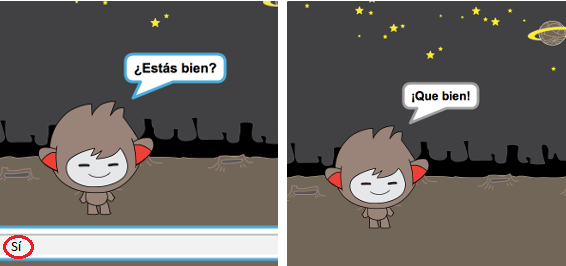
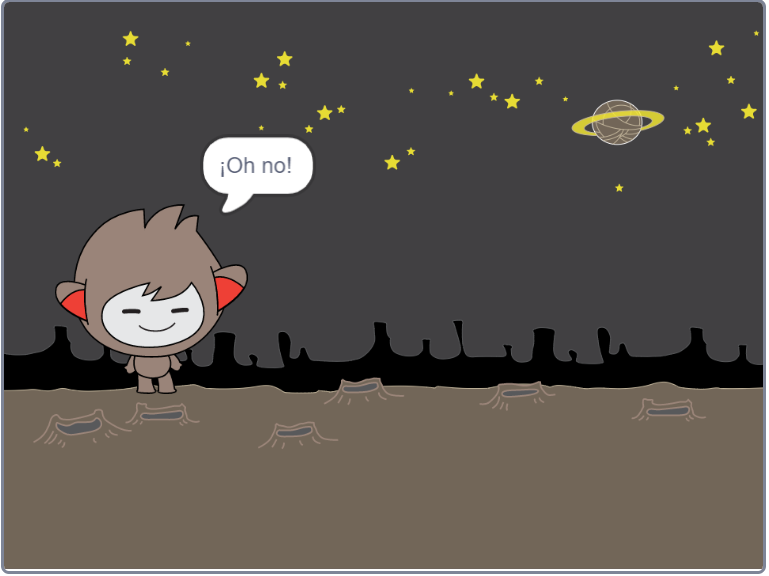
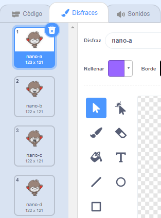

## Tomando decisiones

Puedes programar tu chatbot para que decida qué decir o hacer en función de tus respuestas a sus preguntas.

--- task ---

¿Puedes hacer que el chatbot haga la pregunta "¿Estás bien?" y añadir código para que responda "¡Esto es estupeneo!" solo **si** el usuario responde "sí"?

Para probar tu nuevo código correctamente, debes probarlo **dos veces**, una vez con la respuesta "sí", y una con la respuesta "no".

Tu chatbot debería responder "¡Esto es estupendo!" si respondes "sí", pero no decir nada si respondes "no".

--- hints --- --- hint --- Después de que tu chatbot haya dicho "hola", ahora también debería **preguntar** "¿Estas bien?". **Si** tu respuesta es "sí", entonces el chatbot debe **decir** "¡Esto es estupendo!". --- /hint --- --- hint --- Estos son los bloques de código extra que vas a necesitar:  --- /hint --- --- hint --- Tu código debería quedar así:  --- /hint --- --- /hints ---

--- /task ---

--- task ---

De momento, tu chatbot no dice nada si respondes "no". ¿Puedes cambiar tu chatbot para que también responda "¡Oh, no!" si respondes "no" a su pregunta?

Prueba y guarda. Tu chatbot ahora debería decir "¡Oh, no!" si respondes "no". De hecho, dirá "¡Oh no!" si respondes con algo que no sea "sí" (el **si no** en un bloque `si/si no` significa **en caso contrario**).

--- hints --- --- hint --- Tu chatbot debería decir "Esto es estupendo!" **si** tu respuesta es "si", pero debería decir "Oh no!" si contestas **otra** cosa. --- /hint --- --- hint --- Estos son los bloques de código que vas a necesitar:  --- /hint --- --- hint --- Tu código debería quedar así:  --- /hint --- --- /hints ---

--- /task ---

--- task ---

Puedes poner cualquier código dentro de un bloque `si / si no`, no solo el código para hacer que tu chatbot hable. Si haces un clic en la pestaña **Disfraces** de tu chatbot, verás que tiene más de un disfraz.

--- /task ---

--- task ---

¿Puedes cambiar el disfraz de chatbot para que coincida con tu respuesta?

Prueba y guarda. Deberías ver que la cara de tu chatbot cambia según tu respuesta.

--- hints --- --- hint --- Tu chatbot ahora también debería **cambiar de disfraz** dependiendo de la respuesta recibida. --- /hint --- --- hint --- Estos son los boques de código que necesitarás:  --- /hint --- --- hint --- Tu código debería quedar así  --- /hint --- --- /hints ---

--- /task ---

--- task ---

¿Has notado que el disfraz de tu chatbot sigue siendo el mismo al que cambió la última vez que hablaste con él? ¿Puedes arreglar este problema?

Prueba y guarda: Ejecuta tu código y escribe "no", para que tu chatbot parezca infeliz. Cuando vuelvas a ejecutar tu código, tu chatbot debería volver a tener una cara sonriente antes de preguntar tu nombre.

--- hints --- --- hint --- Cuando **se hace un clic en la figura**, tu chatbot primero debería **cambiar el disfraz** a una cara sonriente. --- /hint --- --- hint --- Estos son los bloques de código que deberás añadir:  --- /hint --- --- hint --- Tu código debería quedar así:  --- /hint --- --- /hints ---

--- /task ---

--- challenge ---

## Desafío: más decisiones

Programa tu chatbot para hacer otra pregunta - algo con una respuesta "sí" o "no". ¿Puedes hacer que tu chatbot conteste a la respuesta?

 --- /challenge ---
