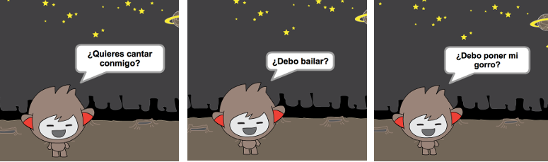

--- challenge ---

## Desafío: termina tu chatbot

Usa lo que has aprendido para terminar de crear tu chatbot interactivo. Aquí hay algunas ideas:

Cuando hayas terminado tu chatbot, trae a tus amigos para tener una conversación con él! ¿Les gusta tu personaje? ¿Han detectado algún problema? ---/challenge---
***
### Traducción aportada por la comunidad 

Este proyecto fue traducido por **María Alejandra Aguada/Montse Verdaguer/Emma Tweed/Helmut Schlimper** y revisado por **Carlos López**. 

Nuestros increíbles voluntarios de traducción nos ayudan a dar a los niños de todo el mundo la oportunidad de aprender a programar. Puedes ayudarnos a llegar a más niños traduciendo nuestros proyectos. Consigue más información en [rpf.io/translators](https://rpf.io/translators).
