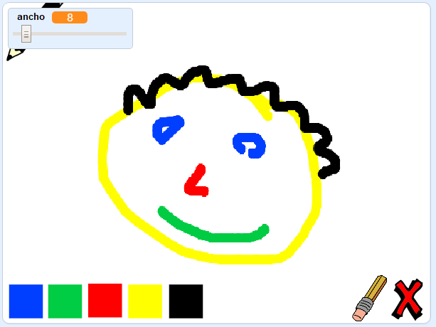

## ¿Qué sigue?

Try the [Paint box](https://projects.raspberrypi.org/en/projects/paint-box?utm_source=pathway&utm_medium=whatnext&utm_campaign=projects) project, where you will create your own painting program!

\--- no-print \--- Haz clic en la bandera verde para comenzar. Utiliza el ratón para mover el lápiz, y mantén presionado el botón de la izquierda para dibujar. Haz clic en un color para cambiar de lápiz. Haz clic en el borrador para cambiar de función, y utilízalo para borrar lo que hayas hecho. Para limpiar la página, haz clic en la cruz.

  <iframe allowtransparency="true" width="485" height="402" src="//scratch.mit.edu/projects/embed/267243161/?autostart=false" frameborder="0" scrolling="no"></iframe>
  

\--- /no-print \---

\--- print-only \--- Harás clic en la bandera verde para comenzar, y utilizarás el ratón para mover el lápiz y mantener apretado el botón izquierdo para dibujar. Hacer clic en el color cambiará el color del lápiz, y haciendo clic en el borrador, ¡cambiará la función a borrador!

 \--- /print-only \---