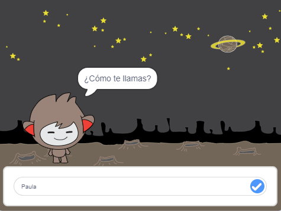

\---no imprimir--

Esta es la versión **Scratch 3** del proyecto. También hay una versión [Scratch 2 del proyecto](https://projects.raspberrypi.org/en/projects/chatbot-scratch2).

\--- /no-imprimir \---

## Introducción

¡Vas a aprender a programar un personaje que te pueda hablar! Un personaje como ese se llama un robot de chat, o chatbot.

### Lo que harás

\--- no-imprimir \---

Haga clic en la bandera verde y luego haga clic en el personaje del chatbot para iniciar una conversación. Cuando el chatbot haga una pregunta, escribe tu respuesta en el cuadro en la parte inferior del escenario y luego haga clic en la marca azul de la derecha (o presione ` Intro `) para ver la respuesta del chatbot.

  <iframe allowtransparency="true" width="485" height="402" src="https://scratch.mit.edu/projects/embed/248864190/?autostart=false" 
  frameborder="0" scrolling="no"></iframe>

\--- /no-imprimir \---

\--- solo imprimir \---

\--- /solo-imprimir \---

## \--- collapse \---

## title: What you will need

### Hardware

- Computadora capaz de ejecutar Scratch 3

### Operativo

- Scratch 3 (ya sea [online](https://rpf.io/scratchon) u [offline](https://rpf.io/scratchoff))

### Descargas

- [ Encuentra los archivos para descargar aquí](http://rpf.io/p/en/chatbot-go).

\--- /collapse \---

## \--- collapse \---

## title: What you will learn

- Use code to join text in Scratch
- Sepa que las variables se pueden usar para almacenar la entrada del usuario
- Use conditional selection to respond to user input in Scratch

\--- /cerrar \---

## \--- collapse \---

## title: Additional notes for educators

\--- no-print \---

If you need to print this project, please use the [printer-friendly version](https://projects.raspberrypi.org/en/projects/chatbot/print){:target="_blank"}.

\--- /no-print \---

You can find the [completed project here](http://rpf.io/p/en/chatbot-get).

\--- /collapse \---