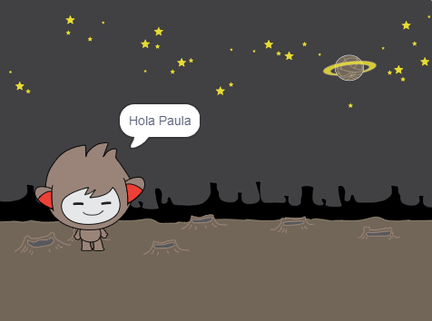

## Un chatbot que habla

Ahora que tienes un chatbot con una personalidad, lo vas a programar para hablar contigo.

\--- task \---

Haga clic en su personaje y añada este código para que `cuando le haga clic en`{:class="block3events"}, le `pida su nombre`{:class="block3sensing"} y luego `diga "¡Qué nombre tan encantador!"`{:class="block3looks"}.


```blocks3
when this sprite clicked
ask [What's your name?] and wait
say [What a lovely name!] for (2) seconds
```

\--- /task \---

\--- task \---

Haga clic en su chatbot para probar su código. Cuando el chatbot pregunte por su nombre, escríbalo en el cuadro que aparece en la parte inferior del escenario y luego haga clic en la marca azul o presione <kbd> Entrar </kbd>.


\--- /task \---

\--- task \---

Ahora mismo, tu chatbot responde "¡Qué nombre encantador!" cada vez que contestas. Puedes hacer que la respuesta del chatbot sea más personal, de modo que la respuesta sea diferente cada vez que se escriba un nombre diferente.

Cambia el código del personaje de tu chatbot a ` unirse ` {: class = "block3operators"} "Hola" con `la respuesta` {: class = "block3sensing"} al "¿Cómo te llamas?" Pregunta, para que el código se vea así:


```blocks3
when this sprite clicked
ask [What's your name?] and wait
say (join [Hi ] (answer) :: +) for (2) seconds
```



\--- /task \---

\--- task \---

Guardando la respuesta en una **variable **, puedes usarla en cualquier parte de tu proyecto.

Crear una nueva variable llamada ` nombre ` {: class = "block3variables"}.

[[[generic-scratch3-add-variable]]]

\--- /task \---

\--- task \---

Ahora, cambie el código de su chatbot para establecer el ` nombre ` {: class = "block3variables"} variable para ` responder ` {: class = "block3sensing"}:


```blocks3
when this sprite clicked
ask [What's your name?] and wait

+ set [name v] to (answer)
say (join [Hi ] (name :: variables +)) for (2) seconds
```

Tu código debería funcionar como antes: tu chatbot debería decir hola usando el nombre que escribes.


\--- /task \---

Prueba tu programa de nuevo. Tenga en cuenta que la respuesta que escriba se almacena en la variable `nombre`{:class="block3variables"} y también se muestra en la esquina superior izquierda de la etapa. Para que desaparezca del Escenario, ve a `Variables`{:class="block3variables"} en la sección de bloques y haz clic en la caja junto a `nombre`{:class="block3variables"} para que quede desmarcada.