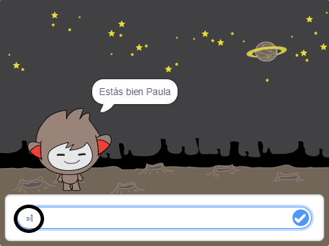
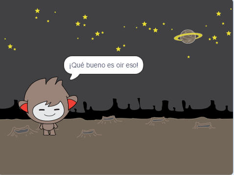
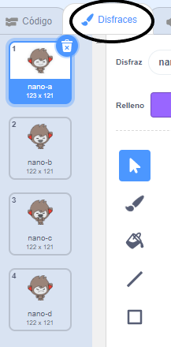
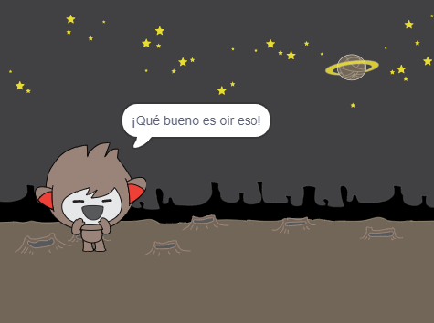
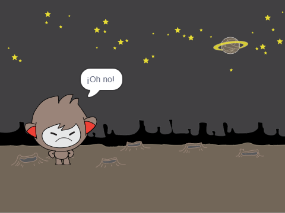
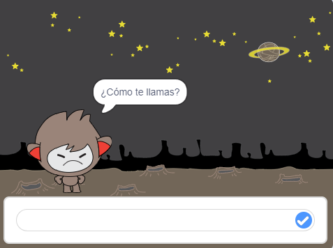
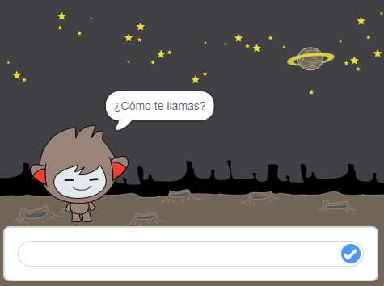

## Tomando decisiones

Usted puede programar su chatbot para decidir qué hacer basado en las respuestas que recibe.

Primero, vas a hacer que tu chatbot haga una pregunta que se pueda responder con "sí" o "no".

\--- tarea \---

Cambia el código de tu chatbot. Su chatbot debe hacer la pregunta "¿Está bien su nombre", usando el nombre ` ` {: class = "block3variables"} variable. Entonces debería responder "¡Qué bueno escuchar!" ` si ` {: class = "block3control"} la respuesta que recibe es "sí", pero no digas nada si la respuesta es "no".






```blocks3
cuando le hagan click al personaje
pregunte [¿Cuál es su nombre?] y espere
ajuste [nombre v] a (responder)
diga (una [Hola] (nombre)) durante (2) segundos
+ pregunte (una  [¿Está bien?] (nombre)) y espere
+ si <(respuesta) = [si]> luego 
  diga [¡Qué bueno escucharte!] durante (2) segundos
final
```

Para probar su nuevo código correctamente, debe probarlo ** dos veces **: una vez con la respuesta "sí", y una vez con la respuesta "no".

\--- / tarea \---

En este momento, tu chatbot no dice nada a la respuesta "no".

\--- tarea \---

Cambia el código de tu chatbot para que responda "¡Oh no!" si recibe "no" como respuesta a "¿Está bien su nombre?".

Reemplace el bloque `si, entonces`{:class="block3control"} con un bloque `si, entonces, otro`{:class="block3control"} y incluya código para que el chatbot pueda `decir "Oh no!"`{:class="block3looks"}.


```blocks3
cuando este sprite hizo clic en
pregunte [¿Cuál es su nombre?] y espere
ajuste [nombre v] a (responder)
diga (unirse a [Hola] (nombre)) durante (2) segundos
preguntar (unirse a [¿Está bien?] ( nombre)) y espere

+ si <(respuesta) = [yes]> entonces 
  diga [¡Qué bueno escuchar!] durante (2) segundos
en otro caso 
+ diga [¡Oh no!] durante (2) segundos
fin
```

\--- / tarea \---

\--- tarea \---

Prueba tu código. Obtendrás una respuesta diferente cuando respondes "no" y cuando responda "sí": el chatbot debe responder con "Que es fantástico escuchar!" al responder "sí" (que no distingue mayúsculas de minúsculas) y responder con "Oh no!" cuando respondes **cualquier cosa**.


\--- /tarea \---

Puedes poner cualquier código dentro de un bloque ` si / si no `, no solo el código para hacer que tu chatbot hable!

Si haces un clic en la pestaña ** disfraz ** de tu chatbot, verás que tiene más de un disfraz.



\--- tarea \---

Cambie el código de su chatbot para que el chatbot cambie de vestuario cuando escriba su respuesta.





Cambie el código dentro del bloque `si, entonces, en otro caso`{:class="block3control"} a ` bloque para cambiar el traje`{:class="block3looks"}.


```blocks3
cuando le hagan click a su personaje 
pregunte [¿Cuál es su nombre?] y espere
ajuste [nombre ] a (responder)
diga ([Hola] + (nombre)) durante (2) segundos
preguntar ([¿Está bien?] +( nombre)) y espere
si <(respuesta) = [SI]> luego 

+ cambie el traje a (nano-c v)
  diga [¡Qué bueno escucharlo!] durante (2) segundos
más 
+ cambie el traje a (nano- d v)
  dice [¡Oh no!] para (2) segundos
final
```

Prueba y guarda tu código. Debería ver cambiar el disfraz de su chatbot dependiendo de su respuesta.

\--- /tarea \---

¿Has notado que, después de que el disfraz de tu chatbot haya cambiado, se mantiene así y no cambia de nuevo a lo que fue al principio?

Puede probar esto: ejecute su código y responda "no" para que la cara de su chatbot cambie a un aspecto infeliz. Luego vuelva a ejecutar su código y observe que su chatbot no vuelve a verse feliz antes de preguntar su nombre.



\--- tarea \---

Para solucionar este problema, agregue al código del chatbot para ` cambiar traje ` {: class = "block3looks"} al inicio ` cuando se hace clic en el personaje ` {: class = "block3events"}.


```blocks3
cuando se hizo clic en el personaje

+ cambiar traje a (nano-a v)
pregunta [Cuál es tu nombre?] y espera
```



\--- / tarea \---