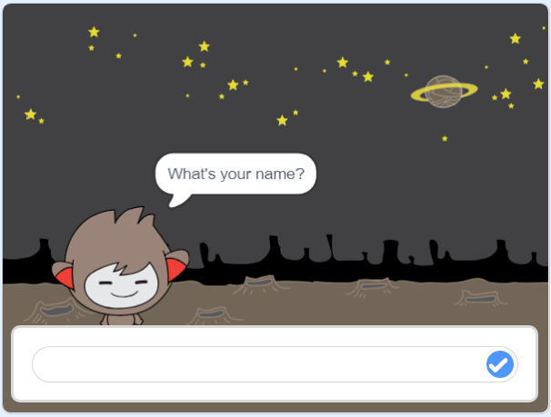

## Vaihe 3: Päättely

Voit ohjelmoida juttelubottisi päättelemään, mitä sanoa tai tehdä vastaustesi perusteella.

\--- task \---

Saatko juttelubottisi kysymään "Oletko kunnossa?" ja koodata sen vastaamaan "Se on hienoa kuulla!" vain ** jos ** käyttäjä vastaa "kyllä"?

Testataksesi uutta koodiasi kunnolla, kokeile sitä ** kahdesti **, kerran vastauksella "kyllä" ja kerran vastauksella "ei".

Juttelubottisi pitäisi vastata "Se on hienoa kuulla!" jos vastaat "kyllä", mutta ei sanoa mitään, jos vastaat "ei".

\--- hints \--- \--- hint \--- Kun juttelubotti on sanonut "Hei", sen pitäisi nyt myös **kysyä** "Oletko kunnossa?". ** Jos ** vastaat "kyllä", juttelubotin pitäisi ** sanoa ** "Se on hienoa kuulla!". \--- /hint \--- \--- hint \--- Tässä ovat tarvitsemasi koodilohkot:  \--- /hint \--- \--- hint \--- Tältä koodisi pitäisi näyttää:  \--- /hint \--- \--- /hints \---

\--- /task \---

\--- task \---

Tällä hetkellä jutteleubotti ei sano mitään, jos vastaat "ei". Voitko muokata juttelubottia niin, että se vastaa myös "Voi ei!" jos vastaat "ei" sen kysymykseen?

Testaa ja tallenna. Juttelubottisi pitäisi nyt sanoa "Voi ei!" jos vastaat "ei". Itse asiassa se sanoo "Voi ei!" jos vastaat muuten kuin "kyllä" (** muuten ** ` jos / muuten ` lohkossa tarkoittaa ** muutoin **).

\--- hints \--- \--- hint \--- Juttelubottisi pitäisi nyt sanoa "Hienoa kuulla!" **jos** vastauksesi on "kyllä", mutta sen piätisi sanoa "Voi ei!" jos vastaat jotenkin **muuten**. \--- /hint \--- \--- hint \--- Tässä ovat tarvitsemasi koodilohkot:  \--- /hint \--- \--- hint \--- Tältä koodisi pitäisi näyttää:  \--- /hint \--- \--- /hints \---

\--- /task \---

\--- task \---

You can put any code inside an `if/else` block, not just code to make your chatbot speak. If you click your chatbot's **Costume** tab, you'll see that it has more than one costume.

\--- /task \---

\--- task \---

Can you change the chatbot's costume to match your response?

Test and save. You should see your chatbot's face change depending on your answer.

\--- hints \--- \--- hint \--- Your chatbot should now also **switch costume** depending on the answer given. \--- /hint \--- \--- hint \--- Here are the code blocks you'll need to use:  \--- /hint \--- \--- hint \--- Here's how your code should look:  \--- /hint \--- \--- /hints \---

\--- /task \---

\--- task \---

Have you noticed that your chatbot's costume stays the same that it changed to the last time you spoke to it? Can you fix this problem?

Test and save: Run your code and type "no", so that your chatbot looks unhappy. When you run your code again, your chatbot should change back to a smiling face before asking your name.

\--- hints \--- \--- hint \--- When the **sprite is clicked**, your chatbot should first **switch costume** to a smiling face. \--- /hint \--- \--- hint \--- Here's the code block you'll need to add:  \--- /hint \--- \--- hint \--- Here's how your code should look:  \--- /hint \--- \--- /hints \---

\--- /task \---

\--- challenge \---

## Haaste: enemmän päätöksiä

Program your chatbot to ask another question - something with a "yes" or "no" answer. Can you make your chatbot respond to the answer?

 \--- /challenge \---