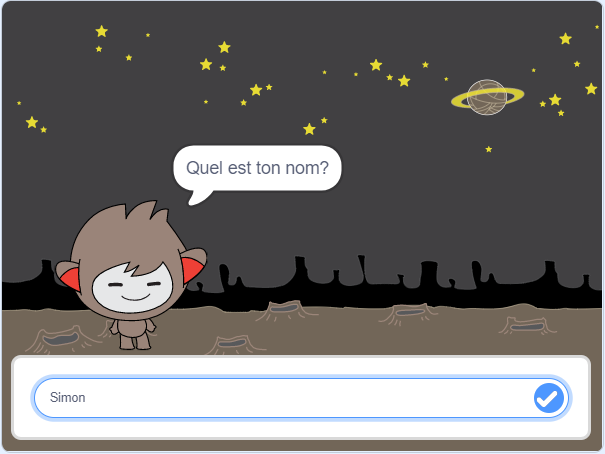

\--- no-print \---

Ceci est la version **Scratch 3** du projet. Il y a aussi une [la version Scratch 2 du projet](https://projects.raspberrypi.org/en/projects/chatbot-scratch2).

\--- /no-print \---

## Introduction

Tu vas apprendre à programmer un personnage capable de vous parler! Un tel personnage s'appelle un robot de chat ou chatbot.

### Ce que tu feras

\--- no-print \---

Clique sur le drapeau vert, puis sur le personnage du chatbot pour lancer une conversation. Lorsque le chatbot pose une question, tape ta réponse dans la zone située au bas de la scène, puis clique sur la marque bleue à droite (ou appuye sur `Entrée`) pour voir la réponse du chatbot.

  <iframe allowtransparency="true" width="485" height="402" src="https://scratch.mit.edu/projects/embed/248864190/?autostart=false" 
  frameborder="0" scrolling="no"></iframe>

\--- /no-print \---

\--- print-only \---

\--- /print-only \---

\--- collapse \---

* * *

## title: Ce qu'il te faut

### Matériel informatique

- Un ordinateur capable d'exécuter Scratch 3

### Logiciels

- Scratch 3 (soit [en ligne](https://rpf.io/scratchon) soit [hors ligne](https://rpf.io/scratchoff))

### Téléchargements

- [Trouve les fichiers à télécharger ici](http://rpf.io/p/en/chatbot-go).

\--- /collapse \---

\--- collapse \---

* * *

## title: Ce que tu vas apprendre

- Use code to concatenate strings in Scratch
- Savoir que les variables peuvent être utilisées pour stocker les entrées de l'utilisateur
- Utiliser la sélection conditionnelle pour répondre à l'utilisateur dans Scratch. \--- /collapse \---

\--- collapse \---

* * *

## title: Notes complémentaires pour les éducateurs

\--- no-print \---

Si vous besoin d'imprimer ce projet, utilisez la [ version imprimable. ](https://projects.raspberrypi.org/en/projects/chatbot/print) {: target = "_ blank"}.

\--- /no-print \---

Vous pouvez trouver le [ projet terminé ici ](http://rpf.io/p/en/chatbot-get) .

\--- /collapse \---