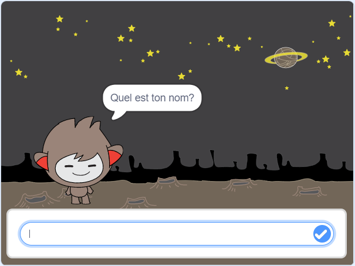
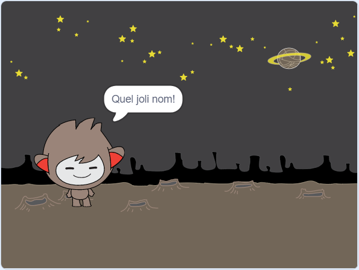
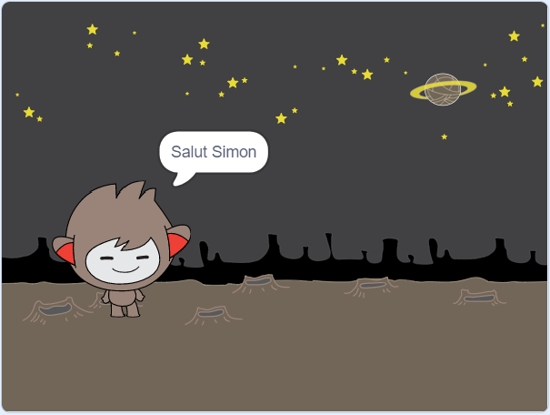

## Un chatbot parlant

Maintenant que tu as un chatbot avec une personnalité, tu vas le programmer pour qu'il te parle.

--- task ---

Clique sur le sprite chatbot et ajoute ce code afin que `quand on clique dessus`{:class="block3events"}, il `vous demande votre nom`{:class="block3sensing"} puis `dit "Quel joli nom!"`{:class="block3looks"}.


```blocks3
quand ce sprite est cliqué
demander [Quel est ton nom?] et attendre
dire [Quel joli nom!] pendant (2) secondes
```

--- /task ---

--- task ---

Clique sur ton chatbot pour ton code. Lorsque le chatbot te demande ton nom, tape-le dans la zone qui apparaît au bas de la scène, puis clique sur le repère bleu ou appuie sur <kbd>Entrée</kbd>.





--- /task ---

--- task ---

En ce moment, ton chatbot répond "Quel joli nom!" chaque fois que tu réponds. Tu peux rendre la réponse du chatbot plus personnelle, de sorte que la réponse soit différente chaque fois que tu entres un nom différent.

Modifie le code du sprite du chatbot en `regrouper`{:class="block3operators"} "Salut" avec la `réponse`{:class="block3sensing"} de la question "Quel est votre nom?", de sorte que le code ressemble à ceci:


```blocks3
quand ce sprite est cliqué
demander [Quel est ton nom?] et attendre
dire (regrouper [Salut ] (réponse) : et : +) pendant (2) secondes
```



--- /task ---

--- task ---

En stockant la réponse dans une **variable**, tu peux l'utiliser n'importe où dans ton projet.

Crée une nouvelle variable appelée `nom`{:class="block3variables"}.

[[[generic-scratch3-add-variable]]]

--- /task ---

--- task ---

Maintenant, change le code de ton sprite chatbot pour définir la variable `nom`{:class="block3variables"} par la variable `réponse`{:class="block3sensing"}:


```blocks3
quand ce sprite est cliqué
demander [Quel est ton nom?] et attendre

+ mettre [nom v] sur (réponse)
dire (regrouper [Salut ] (nom : et : variables +)) pendant (2) secondes
```

Ton code devrait fonctionner comme avant: ton chatbot devrait dire bonjour en utilisant le nom que vous as entré.


--- /task ---

Teste à nouveau ton programme. Note que la réponse que tu tapes est stockée dans la variable `nom`{:class="block3variables"} et est également affichée dans le coin supérieur gauche de la scène. Pour la faire disparaître de la scène, accéde à la section des blocs `Données`{:class="block3variables"} et clique sur la case à côté de `name`{:class="block3variables"} pour qu'elle ne soit pas marquée.