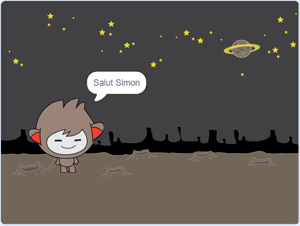
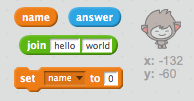
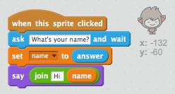
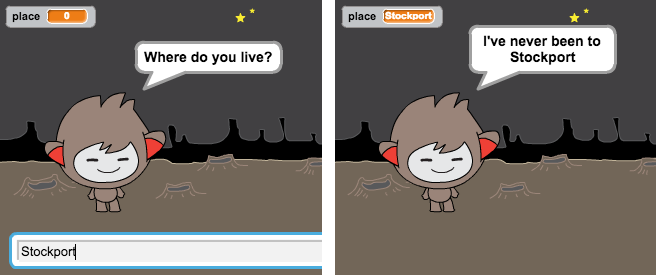

## Un chatbot parlant

Maintenant que vous avez un chatbot avec une personnalité, programmons-le pour vous parler.

\--- task \---

Ajoutez du code à votre chatbot de sorte que quand on clique dessus, il demande votre nom et dit "Quel joli nom!"

\--- astuces \--- \--- indice \--- Lorsque l'image-objet chatbot ** est cliquée ** , il devrait ** demander ** pour ton nom \--- /hint \--- \--- hint \--- Voici les blocs de code dont tu auras besoin:  \--- /hint \--- \--- hint \--- Ton code devrait ressembler à ceci:  \--- /hint \--- \--- /hints \---

\--- /task \---

\--- task \---

Maintenant, le chatbot répond simplement "Quel joli nom!" à chaque fois. Pouvez-vous personnaliser la réponse de votre chatbot en utilisant votre réponse?

\--- astuces \--- \--- indice \--- Lorsque l'image-objet chatbot ** est cliquée ** , il devrait ** demander ** pour ton nom. Le chatbot devrait alors dire ** "Salut" ** , suivi de votre nom ** ** . \--- /hint \--- \--- hint \--- Voici les blocs de code dont tu auras besoin:  \--- /hint \--- \--- hint \--- Ton code devrait ressembler à ceci:  \--- /hint \--- \--- /hints \---

\--- /task \---

\--- task \---

Si vous stockez votre réponse dans une variable ** ** , alors il peut être utilisé plus tard. Créer une nouvelle variable appelée ` nom ` pour stocker votre nom.

[[[generic-scratch-add-variable]]]

\--- /task \---

\--- task \---

Pouvez-vous stocker votre réponse dans la variable `nom` et l'utiliser dans la réponse de votre chatbot?

Votre code devrait fonctionner comme avant: votre chatbot devrait dire bonjour en utilisant votre nom.

\--- astuces \--- \--- indice \--- Lorsque le lutin chatbot ** est cliquée ** , il devrait ** demander ** ton nom. Vous devriez alors régler la variable ** nom ** ` ` à votre ** réponse ** . Le chatbot devrait alors dire ** "Salut" ** , suivi de votre nom ** ** . \--- /hint \--- \--- hint \--- Voici les blocs de code dont tu auras besoin:  \--- /hint \--- \--- hint \--- Ton code devrait ressembler à ceci:  \--- /hint \--- \--- /hints \---

\--- /task \---

\--- défi \---

## Challenge : plus d'objets

Programmez votre chatbot pour poser une autre question. Pouvez-vous stocker la réponse dans une nouvelle variable?

 \--- /défi \---