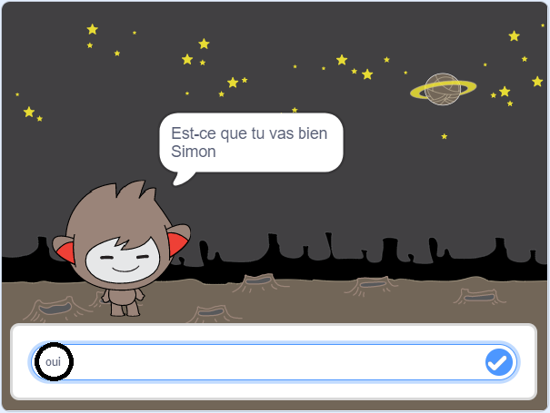
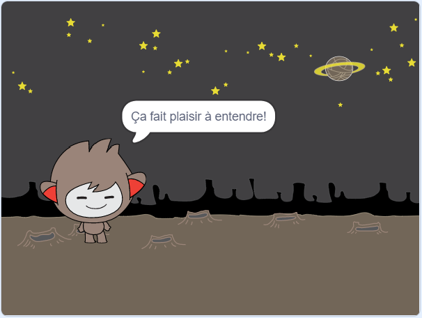
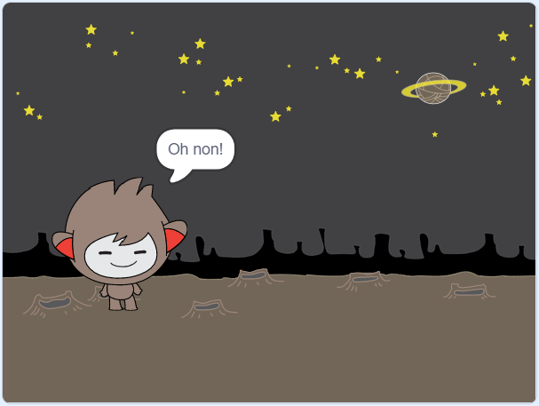
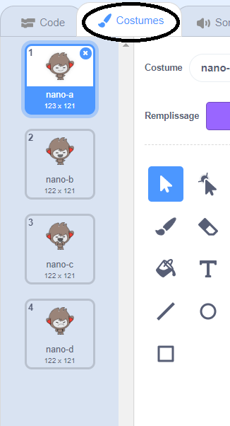
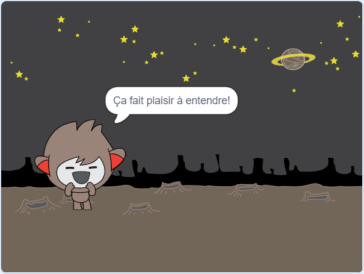
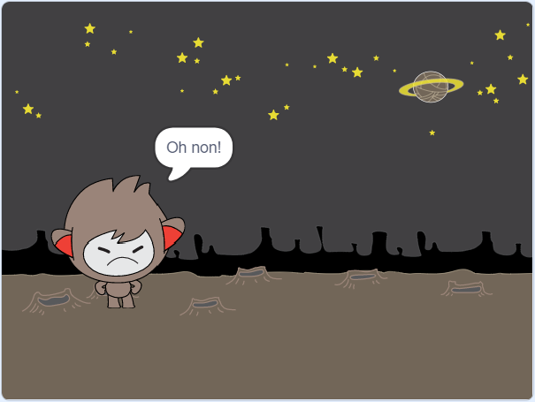

## Prendre des décisions

Tu peux programmer ton chatbot pour qu'il décide quoi faire en fonction des réponses qu'il reçoit.

Tout d'abord, tu vas demander à ton chatbot de poser une question à laquelle on peut répondre par "oui" ou par "non".

\--- task \---

Change le code de ton chatbot. Ton chatbot devrait poser la question "Est-ce que tu vas bien nom", en utilisant la variable `nom`{: class = "block3variables"}. Ensuite, il devrait répondre "Ça fait plaisir à entendre!" `si`{:class="block3control"} la réponse reçue est "oui", mais ne dit rien si la réponse est "non".






```blocks3
quand ce sprite est cliqué
demander [Quel est ton nom?] et attendre
mettre [nom v] à (répondre)
dire (rejoindre [Hi] (nom)) pendant (2) secondes
+ demander (regrouper [Est-ce que tu vas bien ] : et : (nom)) et attendre
+ si <(réponse) = [oui]> alors
 dire [Ça fait plaisir à entendre!] pendant (2) secondes
fin
```

Pour tester ton nouveau code correctement, tu dois le tester **deux fois**: une fois avec la réponse "oui" et une fois avec la réponse "non".

\--- /task \---

At the moment, your chatbot doesn't say anything to the answer "no".

\--- task \---

Change le code de ton chatbot pour qu'il réponde "Oh non!" s'il reçoit "non" comme réponse à "Est-ce que tu vas bien nom".

Remplace le bloc `si, alors`{: class = "block3control"} par un bloc `if, alors, sinon`{: class = "block3control"}, et ajoute du code pour que le chatbot puisse `dire "Oh non!"`{: class = "block3looks"}.


```blocks3
quand ce sprite est cliqué
demander [Comment vous appelez-vous?] et attendre
mettre [nom v] à (répondre)
dire (regrouper [Salut ] : et : (nom)) pendant (2) secondes
demander (regrouper [Est-ce que tu vas bien ] : et : ( name)) et attendre

+ si <(réponse) = [yes]> alors 
dire [Ça fait plaisir à entendre!] pendant (2) secondes
sinon 
+ dire [Oh non!] pendant (2) secondes
fin
```

\--- /task \---

\--- task \---

Teste ton code. Tu devrais obtenir une réponse différente lorsque tu réponds "non" et lorsque tu réponds "oui": ton chatbot doit dire "Ça fait plaisir à entendre!" lorsque tu réponds "oui" (ce n’est pas sensible à la casse), et répliquer par "Oh non!" quand tu réponds à **quelque chose d'autre**.




\--- /task \---

Tu peux mettre n'importe quel code dans un bloc `si, alors, sinon`{: class = "block3control"}, et pas seulement du code pour faire parler ton chatbot!

Si tu cliques sur l'onglet **Costumes** ton chatbot, tu verras qu'il y a plus d'un costume.



\--- task \---

Change le code de ton chatbot pour qu'il change de costume lorsque tu tapes ta réponse.





Modifie le code à l'intérieur du `si, alors, sinon`{: class = "block3control"} bloc en `switch costume`{: class = "block3looks"}.


```blocks3
quand ce sprite est cliqué
demander [Quel est ton nom?] et attendre
mettre [nom v] à (réponse)
dire (regrouper [Salut ] : et : (nom)) pendant (2) secondes
demander (regrouper [Est-ce que tu vas bien ] : et : (nom)) et attendre
si <(réponse) = [oui]> alors 

+ basculer sur le costume en (nano-c v)
  dire [Ça fait plaisir à entendre!] pendant (2) secondes
sinon 
+ basculer sur le costume (nano-d v)
  dire [Oh non!] pendant (2) secondes
fin
```

Teste et enregistre ton code. Tu devrais voir le visage de ton chatbot changer en fonction de ta réponse.

\--- /task \---

As-tu remarqué qu'après que le costume de ton chatbot ait changé, il reste comme ça et ne revient pas à ce qu'il était au début?

Tu peux essayer ceci: lance ton code et répond "non" pour que le visage de ton chatbot change pour une tête triste. Ensuite, relance le code et note que ton chatbot ne redevient pas heureux avant de te demander ton nom.


\--- task \---

Pour résoudre ce problème, ajoute au code du chatbot l'action de `changer de costume`: {: class = "block3looks"} au début `lorsque tu clique sur le sprite`{: class = "block3events"}.


```blocks3
lorsque ce sprite est cliqué

+ basculer sur le costume (nano-a v)
demander [Quel est ton nom?] et attendre
```


\--- /task \---