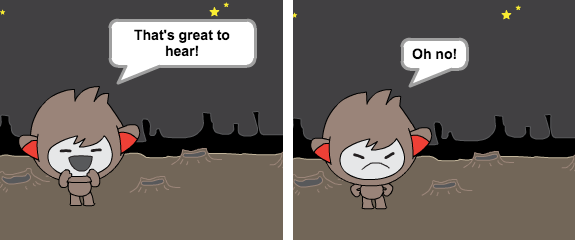
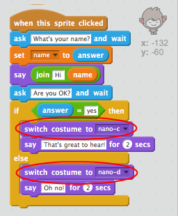
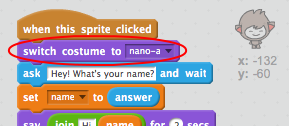

## Étape 3: Prendre des décisions

Vous pouvez programmer votre chatbot pour qu'il decide quoi dire ou faire en fonction de vos réponses à ses questions.

\--- task \---

Pouvez-vous faire en sorte que le chatbot pose la question "Allez vous bien ?", Et le code pour répondre "Je suis heureux de l'entendre!" seulement ** si ** l'utilisateur répond "oui"?

Pour tester correctement votre nouveau code, vous devez le tester deux fois ** ** , une fois avec la réponse "oui", et une fois avec la réponse "non".

Votre chatbot devrait répondre "Je suis content de l'entendre!" si vous répondez «oui», mais ne rien dire si vous répondez «non».

\--- hints \--- \--- hint \--- After your chatbot has said "Hi", it should now also **ask** "Are you OK?". ** Si ** vous répondez "oui", alors le chatbot devrait ** dire ** "C'est bon à entendre!". \--- /hint \--- \--- hint \--- Here are the extra code blocks you'll need:  \--- /hint \--- \--- hint \--- Here's how your code should look:  \--- /hint \--- \--- /hints \---

\--- /task \---

\--- task \---

En ce moment votre chatbot ne dit rien si vous répondez "non". Pouvez-vous changer votre chatbot pour qu'il réponde aussi "Oh non!" Si vous répondez "non" à sa question?

Tester et enregistrer. Votre chatbot devrait maintenant dire "Oh non!" si vous répondez "non". En fait, il dira "On non!" si vous répondez avec autre chose que "oui" (le ** sinon ** dans un bloc ` si / sinon ` signifie ** autrement** ).

\--- hints \--- \--- hint \--- Your chatbot should now say "That's great to hear!" **if** your answer is "yes", but should say "Oh no!" if you answer something **else**. \--- /hint \--- \--- hint \--- Here are the code blocks you'll need to use:  \--- /hint \--- \--- hint \--- Here's how your code should look:  \--- /hint \--- \--- /hints \---

\--- /task \---

\--- task \---

Vous pouvez mettre n'importe quel code dans un bloc ` si / sinon `, pas seulement du code pour faire parler votre chatbot. Si vous cliquez sur l'onglet Costume ** de votre chatbot ** , vous verrez qu'il y a plus d'un costume.

\--- /task \---

\--- task \---

Pouvez-vous changer le costume du chatbot pour qu'il corresponde à votre réponse?

Testez et enregistrez. Vous devriez voir le visage de votre chatbot changer en fonction de votre réponse.

\--- hints \--- \--- hint \--- Your chatbot should now also **switch costume** depending on the answer given. \--- /hint \--- \--- hint \--- Voici les blocs de code dont tu auras besoin:  \--- /hint \--- \--- hint \--- Ton code devrait ressembler à ceci:  \--- /hint \--- \--- /hints \---

\--- /task \---

\--- task \---

Avez-vous remarqué que le costume de votre chatbot reste le même qu'a la dernière fois qu'il a été changer quand vous lui avez parlé? Pouvez-vous résoudre ce problème?

Testez et enregistrez: exécutez votre code et tapez "non", afin que votre chatbot ne soit pas satisfait. Lorsque vous réexécutez votre code, votre chatbot doit revenir à un visage souriant avant de demander votre nom.

\--- hints \--- \--- hint \--- When the **sprite is clicked**, your chatbot should first **switch costume** to a smiling face. \--- /hint \--- \--- hint \--- Voici les blocs de code dont tu auras besoin:  \--- /hint \--- \--- hint \--- Ton code devrait ressembler à ceci:  \--- /hint \--- \--- /hints \---

\--- /task \---

\--- Défi\---

## Challenge : plus d'objets

Programmez votre chatbot pour poser une autre question - quelque chose avec une réponse «oui» ou «non». Pouvez-vous faire en sorte que votre chatbot réponde à la réponse?

 \--- /défi \---