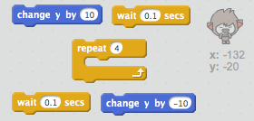
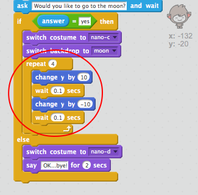

## Changer emplacement

Vous pouvez également coder votre chatbot pour changer son emplacement.

\--- task \---

Ajoutez une autre toile de fond à votre scène, par exemple l'arrière plan "lune".

\--- /task \---

\--- task \---

Pouvez-vous coder votre chatbot pour demander "Voulez-vous aller sur la lune?" puis changez d'emplacement si vous répondez "oui"?

Testez et enregistrez. Si vous répondez "oui", votre chatbot devrait changer d'emplacement. Votre chatbot doit avoir l'air triste et dire "OK ... bye!" si une autre réponse est donnée.

\--- astuces \--- \--- indice \--- Votre chatbot devrait ** demander ** "Voulez-vous aller sur la lune?". ** Si ** votre ** réponse ** est "oui", alors votre chatbot devrait ** changer de costume ** avoir l'air heureux et le décor de la scène ** ** devraient changer.

Si vous répondez "non", le chatbot doit ** changer de costume ** avoir l'air triste et ** dire ** "OK au revoir!"

Vous devrez également ajouter du code pour démarrer votre chatbot au bon endroit ** lorsque vous cliquez dessus ** . \--- /hint \--- \--- hint \--- Here are the code blocks you'll need to use:  \--- /hint \--- \--- hint \--- Here's how your code should look:  \--- /hint \--- \--- /hints \---

\--- /task \---

\--- task \---

Pouvez-vous ajouter du code pour faire bondir votre chatbot de joie si vous lui dites que vous voulez aller sur la lune?

Testez et enregistrez. Si vous répondez "oui", votre chatbot devrait sauter et s'envoler. Il ne devrait pas le faire si une autre réponse est donné.

\--- astuces \--- \--- indice \--- Votre chatbot devrait sauter en ** changeant ** sa position ** y ** un petit peu, puis en revenant après une courte **attente** . You may want to **repeat** this a few times. \--- /hint \--- \--- hint \--- Here are the code blocks you'll need to use:  \--- /hint \--- \--- hint \--- Here's how your code should look:  \--- /hint \--- \--- /hints \---

\--- /task \---