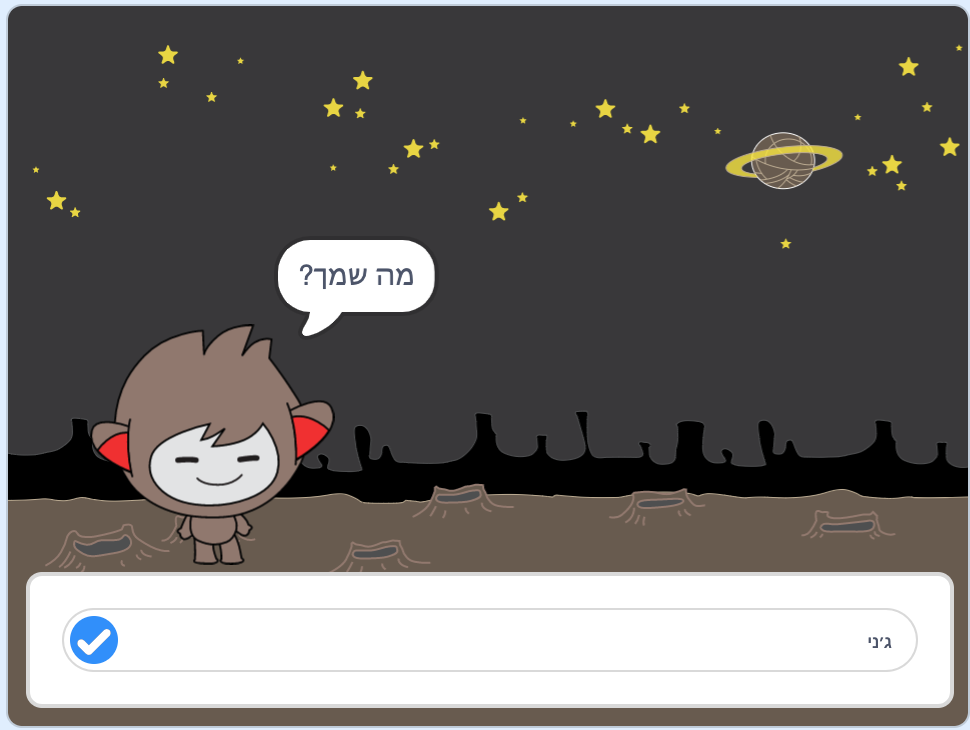

\--- no-print \---

זוהי **סקראץ׳ 3** של הפרויקט. יש גם גרסה [שריטה 2 של הפרויקט](https://projects.raspberrypi.org/en/projects/chatbot-scratch2).

\--- / no-print \---

## מבוא

אתה עומד ללמוד לתכנת דמות שיכולה לדבר איתך! דמות כזו נקראת רובוט צ'אט, או צ'אט בוט.

### מה תבנה

\--- no-print \---

לחץ על הדגל הירוק ואז לחץ על דמות הצ'אט בוט כדי להתחיל שיחה. כאשר צ'אט בוט שואל שאלה, הקלד את התשובה שלך לתיבה שבתחתית ולחץ על הסימון הכחול מצד ימין (או לחץ על ` Enter `) כדי לראות את תשובת הצ'אט.

  <iframe allowtransparency="true" width="485" height="402" src="https://scratch.mit.edu/projects/embed/248864190/?autostart=false" 
  frameborder="0" scrolling="no"></iframe>

\--- / no-print \---

\--- print-only \---

\--- / print-only \---

## \--- collapse \---

## title: למה תזדקק

### חומרה

- מחשב המסוגל להריץ סקראץ׳ 3

### תוכנה

- Scratch 3 (או [ מחובר לאינטרנט ](https://rpf.io/scratchon) או [ לא מחובר לאינטרנט ](https://rpf.io/scratchoff))

### הורדות

- [מצא קבצים להורדה כאן](http://rpf.io/p/en/chatbot-go).

\--- /collapse \---

## \--- collapse \---

## title: מה תלמדו

- Use code to join text in Scratch
- דע כי ניתן להשתמש במשתנים לאחסון קלט מהמשתמש
- השתמש בהתניות כדי להגיב על קלט מהמשתמש

\--- /collapse \---

## \--- collapse \---

## title: מידע נוסף למורים

\--- no-print \---

אם אתה צריך להדפיס את הפרויקט הזה, אנא השתמש ב [ גרסה ידידותית למדפסת ](https://projects.raspberrypi.org/en/projects/chatbot/print).

\--- /no-print \---

אתם יכולים [ להוריד את הפרויקט השלם כאן ](http://rpf.io/p/en/chatbot-get).

\--- /collapse \---