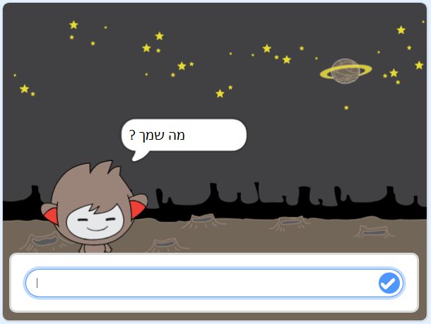
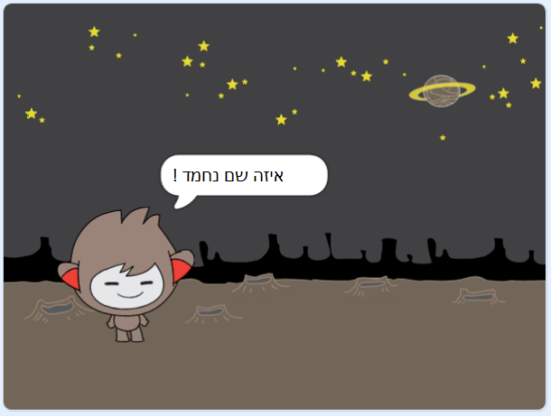
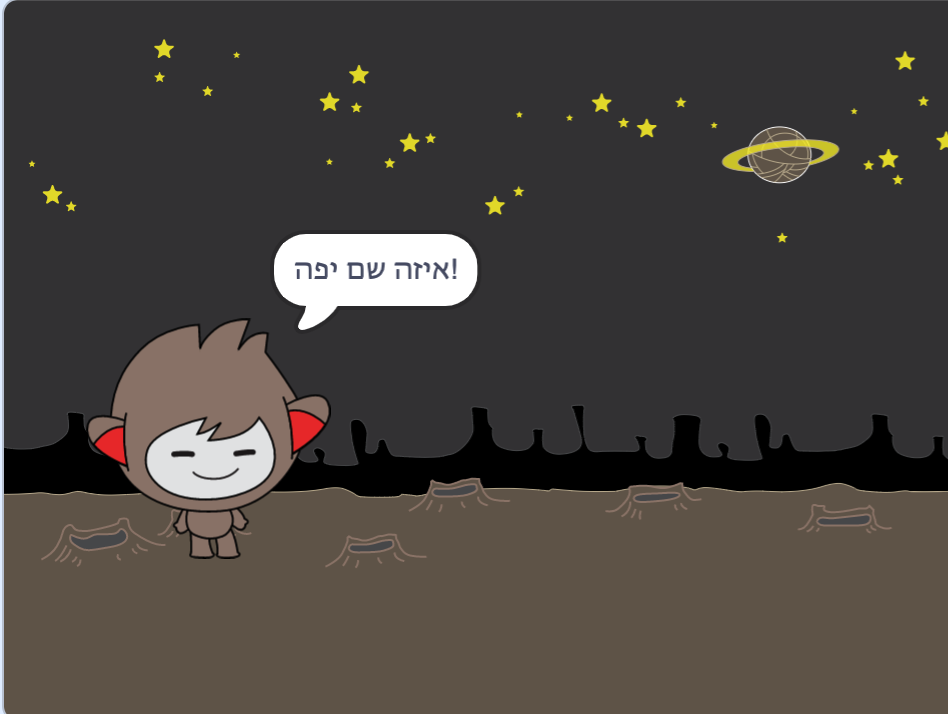

## צ'אטבוט מדבר

עכשיו שיש לך chatbot עם אישיות, אתה הולך לתכנת את זה כדי לדבר איתך.

\--- task \---

לחץ על ה- chatbot sprite והוסף קוד זה, כך ש `כאשר לוחצים עליו`{: class = "block3events"}, הוא מבקש `את שמך`{: class = "block3sensing"} ולאחר מכן `אומר "What a שם אהוב!"`{: class = "block3looks"}.


```blocks3
כאשר זה ספרייט לחץ
לשאול [מה שמך?] ולחכות
לומר [איזה שם יפה!] עבור (2) שניות
```

\--- /task \---

\--- task \---

לחץ על chatbot שלך כדי לבדוק את הקוד שלך. כאשר ה- chatbot מבקש את שמך, הקלד אותו בתיבה שמופיעה בתחתית הבמה, ולאחר מכן לחץ על הסמל הכחול, או הקש <kbd>Enter</kbd>.





\--- /task \---

\--- task \---

כרגע, chatbot שלך משיב "איזה שם יפה!" בכל פעם שאתה עונה. תוכל להפוך את תשובתו של הצ'אט ליותר אישי, כך שהתשובה תהיה שונה בכל פעם שמוקליד שם אחר.

שנו את הקוד של ספרייט chatbot כדי `להצטרף`{: class = "block3operators"} "היי" עם `התשובה`: "מה שמך" {class = "block3sensing"} אל , כך שהקוד נראה כך:


```blocks3
כאשר זה ספרייט לחץ
לשאול [מה שמך?] ולחכות
לומר (הצטרף [היי] (תשובה) +) עבור (2) שניות
```



\--- /task \---

\--- task \---

על ידי אחסון התשובה במשתנה ****, אתה יכול להשתמש בו בכל מקום הפרויקט שלך.

צור משתנה חדש בשם `שם`{: class = "block3variables"}.

[[[generic-scratch3-add-variable]]]

\--- /task \---

\--- task \---

עכשיו, לשנות את הקוד של שדוני chatbot שלך כדי להגדיר את `השם`{: class = "block3variables"} משתנה `תשובה`{: class = "block3sensing"}:


```blocks3
כאשר זה ספרייט לחץ
לשאול [מה שמך?] ולחכות

+ להגדיר [שם v] ל (תשובה)
אומר (הצטרף [היי] (שם :: משתנים +)) עבור (2) שניות
```

הקוד שלך צריך לפעול כמו בעבר: chatbot שלך צריך להגיד שלום באמצעות שם אתה מקליד.


\--- /task \---

בדוק שוב את התוכנית שלך. שים לב כי התשובה שאתה מקליד מאוחסן `השם`{: class = "block3variables"} משתנה, וגם מוצגת בפינה השמאלית העליונה של הבמה. כדי שייעלם מן הבמה, ללכת `נתוני`{: class = "block3variables"} בלוקי מדור ולחץ על התיבה שליד `שם`{: class = "block3variables"} כך שהוא אינו מסומן.