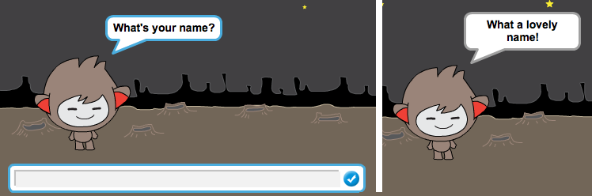
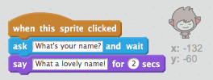
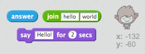

## צ'אטבוט מדבר

עכשיו שיש לכם צ'אטבוט עם אישיות, בואו נתכנת אותו לדבר איתנו.

\--- task \---

הוסיפו קוד לצ'אטבוט שלכם, כך שכאשר לוחצים עליו הוא מבקש את השם שלך ואז אומר "איזה שם יפה!"

\--- hints \--- \--- hint \--- כאשר לוחצים על **דמות הצ'אטבוט**, הוא **שואל** מה שמך. אז הצ'אטבוט **אומר** "איזה שם יפה!" \--- /hint \--- \--- hint \--- הנה קטעי הקוד שתצטרכו:  \--- /hint \--- \--- hint \--- כך צריך הקוד להראות:  \--- /hint \--- \--- /hints \---

\--- /task \---

\--- task \---

עכשיו הצ'אטבוט פשוט עונה "איזה שם יפה!" בכל פעם. האם אתם יכולים להתאים אישית את תשובת הצ'אטבוט שלכם על ידי שימוש בתשובה שהוא קיבל מכם?

\--- hints \--- \--- hint \--- כאשר לוחצים על **דמות הצ'אטבוט**, הוא **שואל** מה שמך. הצ'אטבוט אז צריך ** לומר ** "היי", ולאחר מכן את ** התשובה ** שקיבל מכם. \--- /hint \--- \--- hint \--- הנה קטעי הקוד שתצטרכו:  \--- /hint \--- \--- hint \--- כך צריך הקוד שלכם להראות:  \--- /hint \--- \--- /hints \---

\--- /task \---

\--- task \---

אם תשמרו את התשובה ** במשתנה **, אז זה יכול לשמש אתכם שוב מאוחר יותר. צרו משתנה חדש בשם ` שם ` כדי לאחסן את שמכם.

[[[generic-scratch-add-variable]]]

\--- /task \---

\--- task \---

האם אתם יכולים לאחסן את התשובה שלכם במשתנה `שם `ואז להשתמש במשתנה בתשובה של הצ'אטבוט שלכם?

הקוד שלכם צריך כעת לפעול כמו מקודם: הצ'אטבוט שלכם צריך להגיד שלום ואז את השם שלכם.

\--- hints \--- \--- hint \--- כאשר לוחצים על **דמות הצ'אטבוט **, הוא צריך **לשאול ** מה שמכם. כעת עליכם **להגדיר** את משתנה ה`שם` עבור ה**תשובה**. אז הצ'אטבוט צריך **לומר** "שלום" ואז את ה**שם**. \--- /hint \--- \--- hint \--- הנה קטעי הקוד שתצטרכו:  \--- /hint \--- \--- hint \--- כך צריך הקוד להראות:  \--- /hint \--- \--- /hints \---

\--- /task \---

\--- challenge \---

## אתגר: שאלות נוספות

תכנתו את הצ'אטבוט שלכם כדי לשאול שאלה אחרת. האם ניתן לאחסן את התשובה במשתנה חדש?

 \--- /challenge \---