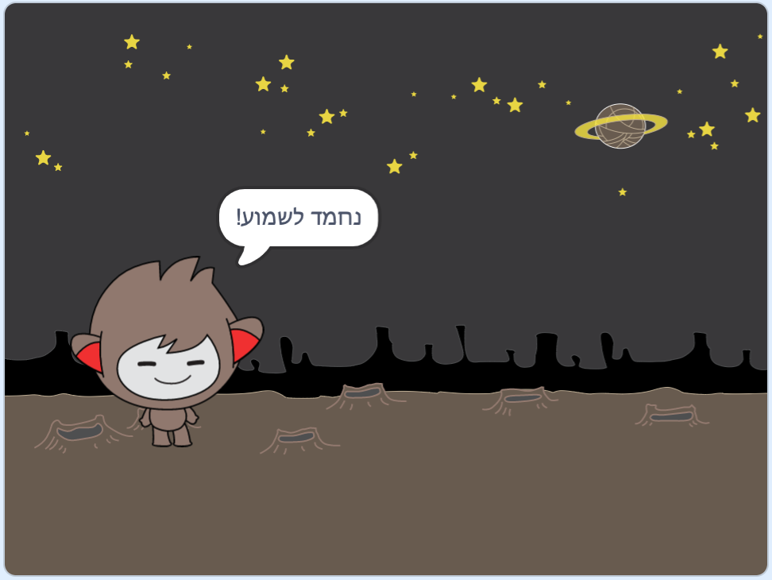
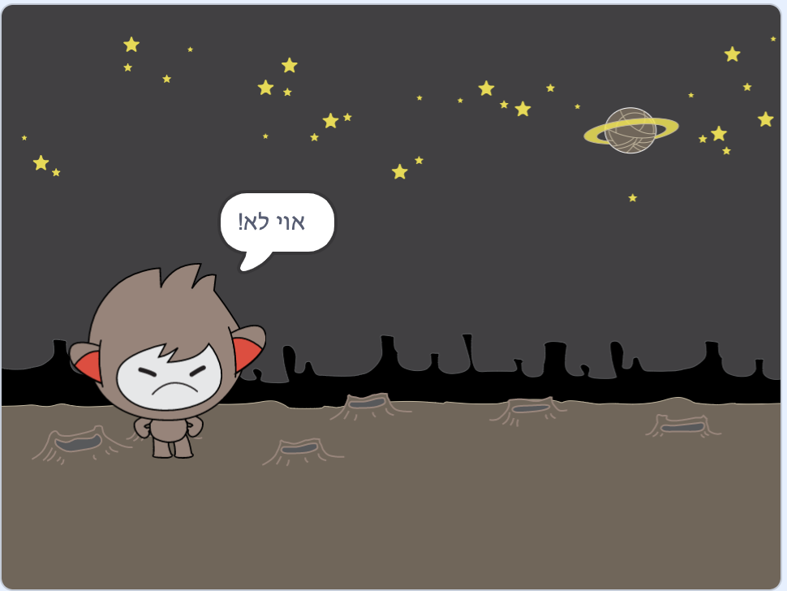

## קבלת החלטות

אתה יכול תוכנית chatbot שלך להחליט מה לעשות על סמך התשובות שהוא מקבל.

ראשית, אתה הולך לעשות את chatbot לשאול שאלה כי ניתן לענות עם "כן" או "לא".

\--- task \---

שנה את הקוד של הצ'אט שלך. Chatbot שלך צריך לשאול את השאלה "האם אתה שם תקין", באמצעות `שם`{: class = "block3variables"} משתנה. אז זה צריך לענות "זה נהדר לשמוע!" `אם`{class = "block3control"} התשובה שהיא מקבלת היא "כן", אבל לא אומר כלום אם התשובה היא "לא".





```blocks3
כאשר השיר הזה לחץ
שאל את [מה שמך] והמתן
[שם v] ל (תשובה)
אומר (הצטרף [היי] (שם)) עבור (2) שניות
+ שאל (הצטרף [האם אתה בסדר] (שם)) ולחכות
+ אם <(תשובה) = [yes]> ואז 
  אומרים [זה נהדר לשמוע!] עבור (2) שניות

```

כדי לבדוק את הקוד החדש שלך כראוי, אתה צריך לבדוק את זה **פעמיים**: פעם עם התשובה "כן", ופעם עם התשובה "לא".

\--- /task \---

כרגע, chatbot שלך לא אומר כלום לתשובה "לא".

\--- task \---

שנה את הקוד של chatbot שלך כך שהוא עונה "אוי לא!" אם הוא מקבל "לא" כתשובה "האם אתה שם בסדר".

החלף את בלוק `אם, ולאחר מכן`{: class = "block3control"} עם בלוק `, אם כן, אחר,`: {class = "block3control"}, והוסף קוד כך שהצ'אטבוט יכול לומר `"לא!"`{: class = "block3looks"}.


```blocks3
כאשר השיר הזה לחץ
שאל [מה שמך] והמתן
[שם v] ל [תשובה]
אומר (הצטרף [היי] (שם)) עבור (2) שניות
לשאול (הצטרף [האם אתה בסדר] שם)) והמתן

+ אם <(תשובה) = [yes]> ואז 
  אמרו [זה נהדר לשמוע!] עבור (2) שניות
אחר 
+ אומרים [הו לא!] עבור (2) שניות

```

\--- /task \---

\--- task \---

בדוק את הקוד שלך. אתה צריך לקבל תגובה אחרת כאשר אתה עונה "לא" וכאשר אתה עונה "כן": chatbot שלך צריך לענות עם "זה נהדר לשמוע!" כאשר אתה עונה "כן" (וזה לא תלוי במקרה), ולהשיב עם "אוי לא!" כשאתה עונה **דבר אחר**.


\--- /task \---

אתה יכול לשים כל קוד בתוך `, אם כן, אחר`{: class = "block3control"} לחסום, לא רק קוד כדי להפוך את chatbot לדבר!

אם תלחץ של chatbot שלך **תחפושות** כרטיסייה, תראה כי יש יותר תחפושת אחת.


\--- task \---

שנה את הקוד של הצ'אט שלך כך שהצ'אטבוט יעביר תלבושות כשאתה מקליד את תשובתך.




לשנות את הקוד בתוך `, אם כן, אחר`{: class = "block3control"} לחסום לתלבושת מתג ``{: class = "block3looks"}.


```blocks3
כאשר השיר הזה לחץ
שאל [מה שמך] והמתן
[שם v] ל [תשובה]
אומר (הצטרף [היי] (שם)) עבור (2) שניות
לשאול (הצטרף [האם אתה בסדר] שם)) ולחכות
אם <(התשובה) = [yes]> ואז 

+ לעבור תחפושת כדי (נ ננו-ג)
  אומרים [זה נהדר לשמוע!] עבור (2) שניות
אחר 
+ לעבור תחפושת כדי (ננו d v)
  לומר [אוי לא!] עבור (2) שניות
סוף
```

בדוק את הקוד שלך ושמור אותו. אתה צריך לראות את הפנים שלך chatbot לשנות בהתאם לתשובתך.

\--- /task \---

האם שמתם לב לכך שלאחר שמלת הצ'אבוט שלך השתנתה, היא נשארת ככה ואינה חוזרת למה שהיה בהתחלה?

אתה יכול לנסות את זה: להפעיל את הקוד שלך לענות "לא", כך הפנים שלך chatbot משתנה למראה אומלל. לאחר מכן הפעל את הקוד שוב והבחין כי chatbot שלך לא משנה בחזרה למראה שמח לפני שהוא שואל את שמך.


\--- task \---

כדי לתקן בעיה זו, הוסף את הקוד של chatbot ל `תחפושת מתג`:: class = "block3looks"} בתחילת `כאשר הספרייט נלחץ`{: class = "block3events"}.


```blocks3
כאשר זה ספרייט לחץ על

+ תלבושת תחליף ל (nano-a)
לשאול [מה שמך?] ולהמתין
```


\--- /task \---