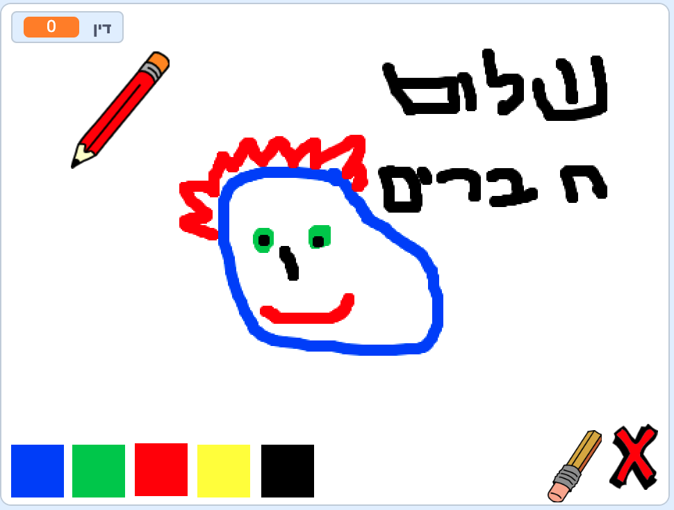

## מה הלאה?

נסה את פרוייקט [ תיבת הצבעים ](https://projects.raspberrypi.org/en/projects/paint-box?utm_source=pathway&utm_medium=whatnext&utm_campaign=projects), שבו תוכלו ליצור תוכנית ציור משלך!

--- no-print ---

לחץ על הדגל הירוק כדי להתחיל. השתמש בעכבר כדי להזיז את העיפרון, והחזק את לחצן העכבר השמאלי כדי לצייר. לחץ על צבע כדי להחליף עפרונות. לחץ על המחק כדי לבחור אותו, והשתמש בו כדי למחוק את העבודה שלך. כדי לנקות את הדף, לחץ על האיקס.

  <iframe allowtransparency="true" width="485" height="402" src="//scratch.mit.edu/projects/embed/267243161/?autostart=false" frameborder="0" scrolling="no"></iframe>
  

--- /no-print ---

--- / print-only ---

אתה תלחץ על הדגל הירוק כדי להתחיל, תשתמש בעכבר כדי להזיז את העיפרון ותלחץ על לחצן העכבר השמאלי כדי לצייר. לחיצה על צבע תשנה את צבע העפרון ולחיצה על המחק תשנה את העפרון למחק!

--- / print-only ---
