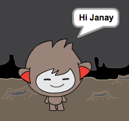

## बात करने वाला चैटबॉट

अब जब आपके पास व्यक्तित्व वाला चैटबॉट है, तो चलिए इसे आपसे बात करने के लिए प्रोग्राम करें।

\--- task \---

अपने चैटबोट स्प्राइट पर क्लिक करें, और इस कोड को इसमें जोड़ें ताकि ` जब यह क्लिक किया जाए ` {"class =" block3events "}, यह ` आपका नाम पूछता है ` {"class =" block3sensing "} और फिर ` कहते हैं" कितना प्यारा नाम! " ` {:class= "block3looks"}।


```blocks3
जब इस स्प्राइट पर क्लिक किया जाता है तो
पूछें [आपका नाम क्या है?] और
बोलें [कितना प्यारा नाम!] for (2)
```

\--- /task \---

\--- task \---

अपने कोड का परीक्षण करने के लिए अपने चैटबॉट पर क्लिक करें। जब चैटबोट आपका नाम पूछती है, तो इसे उस बॉक्स में टाइप करें जो स्टेज के नीचे दिखाई देता है, और फिर नीले निशान पर क्लिक करें, या <kbd> दर्ज करें दबाएं </kbd> ।


\--- /task \---

\--- task \---

अभी, आपका चैटबॉट जवाब देता है "क्या प्यारा नाम है!" हर बार जब आप जवाब देते हैं। आप चैटबोट के उत्तर को अधिक व्यक्तिगत बना सकते हैं, ताकि हर बार एक अलग नाम टाइप करने पर उत्तर अलग-अलग हो।

चैटबॉट स्प्राइट के कोड को ` से जुड़ें ` {:class = "block3operators"} "हाय" </code> {:class =" block3sensing"} के लिए "आपका नाम क्या है?" प्रश्न, ताकि कोड इस तरह दिखे:


```blocks3
जब इस स्प्राइट पर क्लिक किया जाता है तो
पूछें [आपका नाम क्या है?] और
बोलें (join [Hi ] (answer) :: +) for (2) seconds
```



\--- /task \---

\--- task \---

** चर में उत्तर को संग्रहीत करके **, आप इसे अपने प्रोजेक्ट के लिए कहीं भी उपयोग कर सकते हैं।

एक नया चर बनाएं ` नाम ` {:class= "block3variables"}.

[[[generic-scratch3-add-variable]]]

\--- /task \---

\--- task \---

अब, ` नाम सेट करने के लिए अपने चैटबॉट स्प्राइट्स कोड को बदल दें ` {:class = "block3variables"} चर से ` उत्तर ` {:class= "block3sensing"}:


```blocks3
जब इस स्प्राइट पर क्लिक किया जाता है तो
पूछें [आपका नाम क्या है?] और

+ सेट करें [नाम v] से (उत्तर)
कहते हैं (शामिल हों [हाय] (नाम :: चर +)) (2) सेकंड के लिए
```

आपका कोड पहले की तरह काम करना चाहिए: आपके चैटबॉट को आपके द्वारा लिखे गए नाम का उपयोग करके नमस्ते कहना चाहिए।


\--- /task \---

अपने कार्यक्रम का फिर से परीक्षण करें। ध्यान दें कि आपके द्वारा टाइप किया गया उत्तर ` नाम में संग्रहीत है ` {:class ="block3variables"} वैरिएबल, और स्टेज के ऊपरी बाएं कोने में भी दिखाया गया है। इसे मंच से गायब करने के लिए, ` चर पर जाएं ` {"class =" block3variables "} खंड को ब्लॉक करता है और ` नाम के आगे स्थित बॉक्स पर क्लिक करता है ` {"class =" block3variables "} ताकि यह चिह्नित न हो।