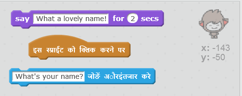
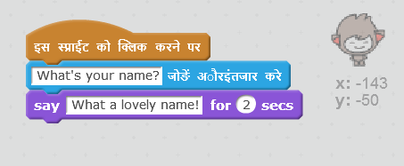
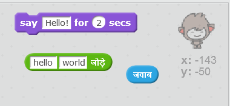
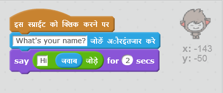
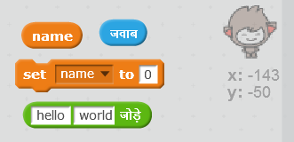

## टॉकिंग चैटबॉट

अब जब आपके पास व्यक्तित्व वाला चैटबॉट है, तो चलिए इसे आपसे बात करने के लिए प्रोग्राम करें।

+ अपने चैटबॉट में कोड जोड़ें ताकि जब इस पर क्लिक किया जाए, तो यह आपका नाम पूछे और फिर कहे "कितना सुंदर नाम है!"

    

[[[generic-scratch-saving]]]

--- hints ---
--- hint ---
जब चैटबॉट __स्प्राइट पर क्लिक किया जाता है__, तो इसे आपका नाम __पूछना__ चाहिए। इसके बाद चैटबॉट को __कहना चाहिए__ "कितना सुंदर नाम है!"
--- /hint ---
--- hint ---
ये वे कोड ब्लॉक हैं, जिनकी आपको आवश्यकता होगी:

--- /hint ---
--- hint ---
आपका कोड कुछ इस प्रकार दिखाई देना चाहिए:

--- /hint ---
--- /hints ---

+ अब चैटबॉट हर बार बस यह उत्तर देता है "कितना सुंदर नाम है!"। क्या आप चैटबॉट को आपके उत्तर का उपयोग करवाकर, उसके उत्तर निजीकृत कर सकते हैं?

    

--- hints ---
--- hint ---
जब चैटबॉट __स्प्राइट पर क्लिक किया जाता है__, तो इसे आपका नाम __पूछना__ चाहिए। फिर चैटबॉट को "हाय" __कहना__ चाहिए, और इसके बाद आपका __उत्तर__ बोलना चाहिए।
--- /hint ---
--- hint ---
ये वे कोड ब्लॉक हैं, जिनकी आपको आवश्यकता होगी:

--- /hint ---
--- hint ---
आपका कोड कुछ इस प्रकार दिखाई देना चाहिए:

--- /hint ---
--- /hints ---

+ यदि आप अपने उत्तर का **वेरिएबल** में संग्रह करते हैं, तो इसकआ बाद में उपयोग किया जा सकता है। अपना नाम संग्रह करने के लिए `नाम` नामक वेरिएबल बनाएँ।

[[[generic-scratch-add-variable]]]

+ क्या आप `नाम` वेरिएबल में अपना नाम संग्रह कर सकते हैं और इसका चैटबॉट के उत्तर में उपयोग कर सकते हैं?

    आपके कोड को पहले की तरह काम करना चाहिए: आपके चैटबॉट को आपके नाम उपयोग करके हेलो कहना चाहिए।

    

--- hints ---
--- hint ---
जब चैटबॉट __स्प्राइट पर क्लिक किया जाता है__, तो इसे आपका नाम __पूछना__ चाहिए। फिर आपको अपने __उत्तर__के लिए `name` वेरिएबल __सेट__ करना होगा। फिर चैटबॉट को "हाय" __कहना__ चाहिए, और इसके बाद आपका __नाम__ बोलना चाहिए।
--- /hint ---
--- hint ---
ये वे कोड ब्लॉक हैं, जिनकी आपको आवश्यकता होगी:

--- /hint ---
--- hint ---
आपका कोड कुछ इस प्रकार दिखाई देना चाहिए:

--- /hint ---
--- /hints ---

--- challenge ---
## चुनौती: अन्य प्रश्न

अन्य प्रश्न पूछने के लिए चैटबॉट को प्रोग्राम करें। क्या आप नए वेरिएबल में उत्तर संग्रह कर सकते हैं?

--- /challenge ---
