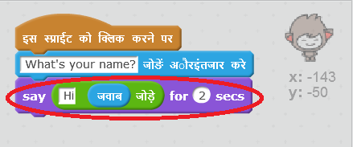

## बात करने वाला चैटबॉट

अब जब आपके पास व्यक्तित्व वाला चैटबॉट है, तो चलिए इसे आपसे बात करने के लिए प्रोग्राम करें।

\--- task \---

अपने चैटबॉट में कोड जोड़ें ताकि जब इस पर क्लिक किया जाए, तो यह आपका नाम पूछे और फिर कहे "कितना सुंदर नाम है!"

\--- hints \--- \--- hint \--- जब चैटबॉट **स्प्राइट पर क्लिक किया जाता है**, तो इसे आपका नाम **पूछना** चाहिए। चैटबॉट को तब कहना चाहिए "What a lovely name!" \--- /hint \--- \--- hint \--- ये वे कोड ब्लॉक हैं, जिनकी आपको आवश्यकता होगी:  \--- /hint \--- \--- hint \--- आपका कोड कुछ इस प्रकार दिखाई देना चाहिए  \--- /hint \--- \--- /hints \---

\--- /task \---

\--- task \---

अब चैटबॉट हर बार "What a lovely name!" उत्तर देता है। क्या आप अपने उत्तर का उपयोग करके अपने चैटबॉट के जवाब को निजीकृत कर सकते हैं?

\--- hints \--- \--- hint \--- जब चैटबॉट **स्प्राइट पर क्लिक किया जाता है**, तो इसे आपका नाम **पूछना** चाहिए। फिर चैटबॉट को "Hi" **कहना** चाहिए, और इसके बाद आपका **उत्तर** बोलना चाहिए। \--- /hint \--- \--- hint \--- ये वे कोड ब्लॉक हैं, जिनकी आपको आवश्यकता होगी:  \--- /hint \--- \--- hint \--- आपका कोड इस प्रकार दखाई देगा:  \--- /hint \--- \--- /hints \---

\--- /task \---

\--- task \---

यदि आप अपने उत्तर को **वेरिएबल** में संग्रह करते हैं, तो इसे बाद में उपयोग किया जा सकता है। अपना नाम संग्रह करने के लिए `name` वेरिएबल बनाएँ।

[[[generic-scratch-add-variable]]]

\--- /task \---

\--- task \---

क्या आप `name` वेरिएबल में अपना नाम संग्रह कर सकते हैं और इसका चैटबॉट के उत्तर में उपयोग कर सकते हैं?

Your code should work as before: your chatbot should say hello using your name.

\--- hints \--- \--- hint \--- When the chatbot **sprite is clicked**, it should **ask** for your name. You should then **set** the `name` variable to your **answer**. The chatbot should then **say** "Hi", followed by your **name**. \--- /hint \--- \--- hint \--- Here are the code blocks you'll need:  \--- /hint \--- \--- hint \--- Here's how your code should look:  \--- /hint \--- \--- /hints \---

\--- /task \---

\--- challenge \---

## Challenge: more questions

Program your chatbot to ask another question. Can you store the answer in a new variable?

 \--- /challenge \---