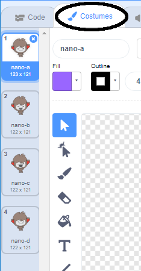
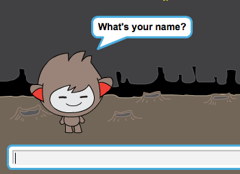

## निर्णय लेना

आप अपने चैटबोट को यह तय करने के लिए प्रोग्राम कर सकते हैं कि उसे प्राप्त उत्तरों के आधार पर क्या करना है।

सबसे पहले, आप अपना चैटबॉट बनाने जा रहे हैं एक प्रश्न पूछें जिसका उत्तर "yes" या "no" के साथ दिया जा सकता है।

--- task ---

अपने चैटबोट का कोड बदलें। आपके चैटबोट को `name`{:class="block3variables"} का उपयोग करके "Are you OK name" सवाल पूछना चाहिए । तो यह जवाब देना चाहिए "That's great to hear!" `यदि`{:class="block3control"} इसे प्राप्त होने वाला उत्तर "yes" है, लेकिन यदि उत्तर "no" है तो कुछ भी न कहें।


```blocks3
when this sprite clicked
ask [What's your name?] and wait
set [name v] to (answer)
say (join [Hi ] (name)) for (2) seconds
+ask (join [Are you OK ] (name)) and wait
+if <(answer) = [yes]> then 
  say [That's great to hear!] for (2) seconds
end
```

अपने नए कोड को ठीक से जांचने के लिए, आपको इसको **दो बार**: जांचना चाहिए।एक बार "yes" और एक बार "no" के साथ।

--- /task ---

फिलहाल, आपका चैटबॉट जवाब "no" के लिए कुछ भी नहीं कहता है।

--- task ---

अपने चैटबोट का कोड बदलें ताकि यह जवाब दे कि "Oh no!" अगर यह "no" आपको "Are you OK name" के उत्तर के रूप में प्राप्त होता है।

`if, then`{:class="block3control"} एकके साथ ब्लॉक करें `if, then, else`{:class="block3control"} ब्लॉक करें, और कोड शामिल करें ताकि चैटबोट `कहें (say) "Oh no!"`{:class="block3looks"}।


```blocks3
when this sprite clicked
ask [What's your name?] and wait
set [name v] to (answer)
say (join [Hi ] (name)) for (2) seconds
ask (join [Are you OK ] (name)) and wait
+ if <(answer) = [yes]> then 
  say [That's great to hear!] for (2) seconds
else 
+  say [Oh no!] for (2) seconds
end
```

--- /task ---

--- task ---

अपने कोड का परीक्षण करें। जब आप "no" का जवाब देते हैं और जब आप "yes" का जवाब देते हैं, तो आपको एक अलग प्रतिक्रिया मिलनी चाहिए: आपके चैटबोट को "That's great to hear!" जब आप "yes" (जो मामला-संवेदनशील नहीं है) का उत्तर देते हैं, और "Oh no!" जब आप जवाब देते हैं **कुछ और** ।


--- /task ---

आप किसी भी कोड को के अंदर रख सकते हैं, `if, then, else`{:class="block3control"} ब्लॉक करें, न कि सिर्फ अपने चैटबोट को बोलने के लिए कोड बनाएं!

यदि आप अपने चैटबोट के **Costumes** टैब, आप देखेंगे कि एक से अधिक पोशाक है।



--- task ---

अपने चैटबोट का कोड बदलें ताकि जब आप अपने उत्तर में टाइप करें तो चैटबॉट कॉस्टयूम बदल दे।


कोड को के अंदर बदलें, `if, then, else`{:class="block3control"} ब्लॉक को `switch costume`{:class="block3looks"}।


```blocks3
when this sprite clicked
ask [What's your name?] and wait
set [name v] to (answer)
say (join [Hi ] (name)) for (2) seconds
ask (join [Are you OK ] (name)) and wait
if <(answer) = [yes]> then 
+  switch costume to (nano-c v)
  say [That's great to hear!] for (2) seconds
else 
+  switch costume to (nano-d v)
  say [Oh no!] for (2) seconds
end
```

टेस्ट करें और अपना कोड सेव करें। आपको अपने उत्तर के आधार पर अपने चैटबोट के चेहरे का बदलाव देखना चाहिए।

--- /task ---

क्या आपने देखा है कि, आपके चैटबोट की पोशाक बदल जाने के बाद, यह वैसा ही रहता है और जो शुरू में था, उसे वापस नहीं बदलता है।

आप इसे आज़मा सकते हैं: अपना कोड चलाएं और "no" का उत्तर दें ताकि आपके चैटबोट का चेहरा दुखी नज़र आए। फिर अपना कोड फिर से चलाएं और ध्यान दें कि आपका चैटबॉट आपके नाम पूछने से पहले खुश दिखने के लिए वापस नहीं बदलता है।


--- task ---

इस समस्या को ठीक करने के लिए, चैटबॉट के कोड को स्विच कॉस्ट्यूम `में जोड़ें`{:class="block3looks"} शुरू में जब `स्प्राइट पर क्लिक किया जाता है`{:class="block3events"}।


```blocks3
when this sprite clicked
+ switch costume to (nano-a v)
ask [What's your name?] and wait
```



--- /task ---