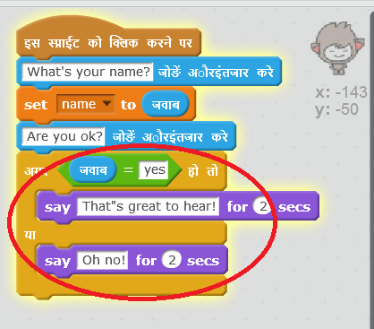

## चरण 3: निर्णय लेना

आप अपने चैटबॉट को इसके प्रश्नों पर आपके प्रत्युत्तर के आधार पर यह तय करने के लिए प्रोग्राम कर सकते हैं कि यह क्या कहेगा या क्या करेगा।

+ क्या आप चैटबॉट को आपसे "क्या आप ठीक हैं?" पूछने के लिए तैयार कर सकते हैं, और जवाब देने पर "यह सुनकर बहुत अच्छा लगा!" बोलने के लिए कोड कर सकते हैं, __अगर __ उपयोगकर्ता का उत्तर केवल "हाँ" हो?

    अपने नए कोड को ठीक से जांचने के लिए, आपको इसकी एक बार "हाँ" और एक  बार "नहीं" के साथ__दो बार__ जांच करनी चाहिए।

    यदि आपका उत्तर "हाँ" है, तो आपके चैटबॉट को "यह सुनकर बहुत अच्छा लगा!" जवाब देना चाहिए, परन्तु यदि आप "नहीं" उत्तर देते हैं, तो इसे कुछ नहीं कहना चाहिए।

    

--- hints ---
--- hint ---
आपके चॅटबोट द्वारा "हाय" कहने के बाद, अभी यह भी __पूछना__ चाहिए "क्या आप ठीक हैं?" __अगर __ आपका उत्तर "हां" है, तो चॅटबोट को __ कहना__ चाहिए "यह सुनकर बहुत अच्छा लगा!"
--- /hint ---
--- hint ---
ये वे अतिरिक्त कोड ब्लॉक हैं, जिनकी आपको आवश्यकता होगी:

--- /hint ---
--- hint ---
आपका कोड कुछ इस प्रकार दिखाई देना चाहिए:

--- /hint ---
--- /hints ---

+ फ़िलहाल अगर आपका उत्तर "नहीं" है, तो आपका चैटबॉट कुछ नहीं कहता। क्या आप अपने चैटबॉट में परिवर्तन कर सकते हैं कि यह इसके प्रश्न पर आपकी "नहीं" प्रत्युत्तर पर "ओह नो" उत्तर दे?

    परीक्षण करें और सहेजें। यदि आप "नहीं" उत्तर देते हैं, तो आपके चैटबॉट को "ओह नो!" कहना चाहिए। असल में, यदि आप "हाँ" के अलावा कोई अन्य उत्तर देते हैं, तो यह कहेगा "ओह नो!" (`अगर/या` ब्लॉक में __वरना __ का अर्थ __अन्यथा__होता है)।

    

--- hints ---
--- hint ---
आपके चैटबॉट को अब कहना चाहिए, "यह सुनकर अच्छा लगा!" __अगर__ आपका उत्तर "हाँ" है, परन्तु यदि उत्तर __या__ है, तो कहना चाहिए, "ओह नो!"।
--- /hint ---
--- hint ---
ये वे कोड ब्लॉक हैं, जिनकी आपको उपयोग के लिए आवश्यकता होगी:

--- /hint ---
--- hint ---
आपका कोड कुछ इस प्रकार दिखाई देना चाहिए:

--- /hint ---
--- /hints ---

+ आप `अगर/या` ब्लॉक के भीतर अपने चैटबॉट को बुलवाने के लिए यह कोड ही नहीं, कोई भी कोड जोड़ सकते हैं। यदि आप अपने चैटबॉट के **पोशाक** टैब पर क्लिक करें, तो आप देखेंगे कि इसमें एक से अधिक पोशाक हैं।

    

+ क्या आप चैटबॉट की पोशाक को अपने प्रत्युत्तर से मिलाने के लिए बदल सकते हैं?

    परीक्षण करें और सहेजें। आपको अपने उत्तर के आधार पर चैटबॉट के चेहरे में बदलाव दिखना चाहिए।

    

--- hints ---
--- hint ---
आपके दिए गए उत्तर के आधार पर आपके चैटबॉट को अब __पोशाक भी बदलनी__ चाहिए।
--- /hint ---
--- hint ---
ये वे कोड ब्लॉक हैं, जिनकी आपको उपयोग के लिए आवश्यकता होगी:

--- /hint ---
--- hint ---
आपका कोड कुछ इस प्रकार दिखाई देना चाहिए:

--- /hint ---
--- /hints ---

+ क्या आपने ध्यान दिया है कि आपके चैटबॉट की पोशाक का रंग समान रहता है, जो इसने तब बदला था, जब आपने इससे पिछली बार बात की थी? क्या आप इस समस्या को ठीक कर सकते हैं?

    

    परीक्षण करें और सहेजें: अपना कोड रन करें और "no" टाइप करें, ताकि आपका चैटबॉट नाखुश दिखाई दे। जब आप अपना कोड पुनः रन करते हैं, तो आपके चैटबॉट को आपका नाम पूछने से पहले खुशनुमा चेहरे में बदल जाना चाहिए।

    

--- hints ---
--- hint ---
जब __स्प्राइट पर क्लिक किया जाता है__, तो आपके चैटबॉट को पहले__ खुशनुमा चेहरे में __पोशाक__ बदलनी होगी।
--- /hint ---
--- hint ---
ये वे कोड ब्लॉक हैं, जिनकी आपको जोड़ने के लिए आवश्यकता होगी:

--- /hint ---
--- hint ---
आपका कोड कुछ इस प्रकार दिखाई देना चाहिए:

--- /hint ---
--- /hints ---

--- challenge ---
## चुनौती: अधिक निर्णय

अपने चैटबॉट को अन्य प्रश्न पूछने के लिए कोड करें - "हाँ" या "नहीं" उत्तर के साथ कुछ और। क्या आप ऐसा कर सकते हैं कि आपका चैटबॉट उत्तर पर प्रत्युत्तर दे?

--- /challenge ---
