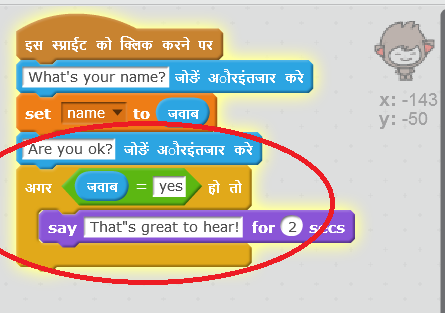
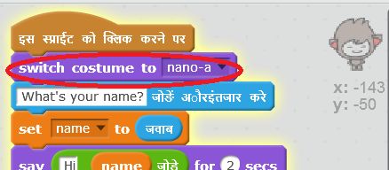

## चरण 3: निर्णय लेना

आप अपने चैटबॉट को अपने प्रश्नों के उत्तर के आधार पर क्या कहना है या क्या करना है यह तय करने के लिए प्रोग्राम कर सकते हैं।

\--- task \---

क्या आप चैटबॉट को "Are you OK?" पूछने के लिए तैयार कर सकते हैं, और उत्तर "That's great to hear!" बोलने के लिए कोड कर सकते हैं, **अगर** उपयोगकर्ता का उत्तर केवल "yes" हो?

अपने नए कोड को ठीक से जांचने के लिए, आपको इसको **दो बार** जांचना चाहिए।एक बार "yes" और एक बार "no" के साथ।

अगर आपका उत्तर "yes" है, तो आपके चैटबॉट को "That's great to hear!" जवाब देना चाहिए, परन्तु यदि आप "no" उत्तर देते हैं, तो इसे कुछ नहीं कहना चाहिए।

\--- hints \--- \--- hint \--- आपके चॅटबोट द्वारा "Hi" कहने के बाद, उसे अब "Are you OK?" भी **पूछना** चाहिए। **अगर** आपका उत्तर "yes" है, तो चॅटबोट को "That's great to hear!" **कहना** चाहिए। \--- /hint \--- \--- hint \--- ये वे अतिरिक्त कोड ब्लॉक हैं, जिनकी आपको आवश्यकता होगी:  \--- /hint \--- \--- hint \--- आपका कोड इस प्रकार दखाई देगा:  \--- /hint \--- \--- /hints \---

\--- /task \---

\--- task \---

इस समय अगर आपका उत्तर "no" है, तो आपका चैटबॉट कुछ नहीं कहता। क्या आप अपने चैटबॉट में परिवर्तन कर सकते हैं ताकि यह जवाब दे सके "Oh no!" यदि आप इसके प्रश्न के लिए "no" का जवाब देते हैं?

परीक्षण करें और सहेजें। यदि आप "no" उत्तर देते हैं, तो आपके चैटबॉट को "Oh no" कहना चाहिए। In fact, it will say "On no!" if you answer with anything other than "yes" (the **else** in an `if/else` block means **otherwise**).

\--- hints \--- \--- hint \--- Your chatbot should now say "That's great to hear!" **if** your answer is "yes", but should say "Oh no!" if you answer something **else**. \--- /hint \--- \--- hint \--- Here are the code blocks you'll need to use:  \--- /hint \--- \--- hint \--- Here's how your code should look:  \--- /hint \--- \--- /hints \---

\--- /task \---

\--- task \---

You can put any code inside an `if/else` block, not just code to make your chatbot speak. If you click your chatbot's **Costume** tab, you'll see that it has more than one costume.

\--- /task \---

\--- task \---

Can you change the chatbot's costume to match your response?

Test and save. You should see your chatbot's face change depending on your answer.

\--- hints \--- \--- hint \--- Your chatbot should now also **switch costume** depending on the answer given. \--- /hint \--- \--- hint \--- Here are the code blocks you'll need to use:  \--- /hint \--- \--- hint \--- Here's how your code should look:  \--- /hint \--- \--- /hints \---

\--- /task \---

\--- task \---

Have you noticed that your chatbot's costume stays the same that it changed to the last time you spoke to it? Can you fix this problem?

Test and save: Run your code and type "no", so that your chatbot looks unhappy. When you run your code again, your chatbot should change back to a smiling face before asking your name.

\--- hints \--- \--- hint \--- When the **sprite is clicked**, your chatbot should first **switch costume** to a smiling face. \--- /hint \--- \--- hint \--- Here's the code block you'll need to add:  \--- /hint \--- \--- hint \--- Here's how your code should look:  \--- /hint \--- \--- /hints \---

\--- /task \---

\--- challenge \---

## Challenge: more decisions

Program your chatbot to ask another question - something with a "yes" or "no" answer. Can you make your chatbot respond to the answer?

 \--- /challenge \---